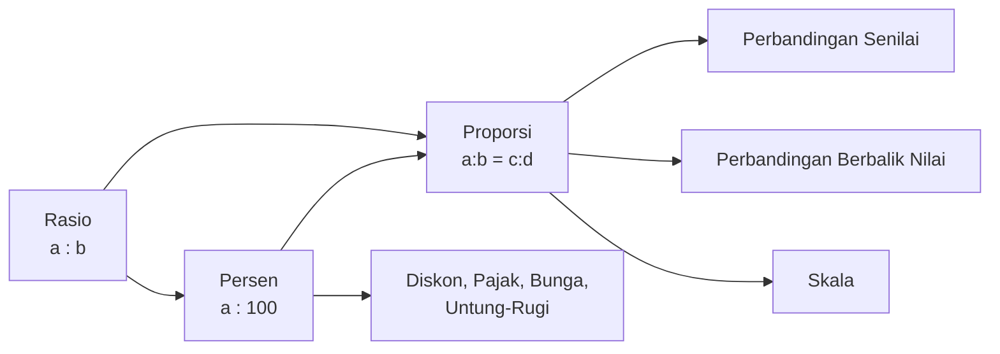

# Persen, Rasio, dan Proporsi

> [!info] Gambaran Umum
> Tiga konsep ini saling terkait erat. **Persen** pada dasarnya adalah bentuk khusus dari **rasio** (rasio dengan penyebut 100), sedangkan **proporsi** adalah pernyataan bahwa dua rasio bernilai sama. Memahami hubungan ini membuat banyak masalah perbandingan menjadi mudah dipecahkan.

---

## 1. Persen

### 1.1 Definisi

> [!note] Definisi Persen
> **Persen** berasal dari bahasa Latin *per centum* yang berarti "per seratus". Persen adalah cara menyatakan suatu pecahan dengan penyebut tetap 100. Simbol persen adalah **%**.
>
> $$a\% = \frac{a}{100}$$

Alasan persen menggunakan basis 100: angka 100 dipilih karena memberikan tingkat ketelitian yang cukup untuk kehidupan sehari-hari sekaligus mudah dibandingkan. Dengan penyebut yang seragam (100), dua nilai persen dapat langsung dibandingkan tanpa perlu menyamakan penyebut terlebih dahulu.

### 1.2 Konversi Persen, Pecahan, dan Desimal

Karena persen adalah pecahan dengan penyebut 100, persen dapat dikonversi ke bentuk pecahan biasa maupun desimal.

| Bentuk    | Cara Konversi                              | Contoh                                |
| --------- | ------------------------------------------ | ------------------------------------- |
| Persen → Pecahan | Tulis bilangan persen sebagai pembilang dengan penyebut 100, lalu sederhanakan | $25\% = \frac{25}{100} = \frac{1}{4}$ |
| Persen → Desimal | Bagi bilangan persen dengan 100 (geser koma dua tempat ke kiri) | $25\% = 0{,}25$                       |
| Pecahan → Persen | Kalikan pecahan dengan $100\%$            | $\frac{3}{5} = \frac{3}{5} \times 100\% = 60\%$ |
| Desimal → Persen | Kalikan desimal dengan $100\%$ (geser koma dua tempat ke kanan) | $0{,}07 = 7\%$ |

### 1.3 Persen dari Suatu Nilai

> [!note] Rumus Dasar
> $$a\% \text{ dari } N = \frac{a}{100} \times N$$

Rumus ini berlaku karena $a\%$ adalah pecahan $\frac{a}{100}$, dan "dari" dalam matematika sehari-hari berarti perkalian.

> [!example] Ilustrasi
> $20\%$ dari $150$ adalah $\frac{20}{100} \times 150 = 30$.

### 1.4 Mencari Persentase

Jika ingin mengetahui berapa persen suatu bagian dari keseluruhan, gunakan:

$$\text{Persentase} = \frac{\text{bagian}}{\text{keseluruhan}} \times 100\%$$

Rumus ini diturunkan langsung dari definisi: rasio bagian-terhadap-keseluruhan dinyatakan dalam basis 100.

### 1.5 Mencari Nilai Keseluruhan

Jika diketahui sebuah bagian merupakan $a\%$ dari keseluruhan, maka:

$$\text{Keseluruhan} = \frac{\text{bagian}}{a\%} = \frac{\text{bagian} \times 100}{a}$$

### 1.6 Persentase Perubahan

> [!note] Definisi
> **Persentase perubahan** adalah perbandingan selisih nilai baru dan nilai lama terhadap nilai lama, dinyatakan dalam persen.

- **Persentase kenaikan:**
$$\%_{\text{naik}} = \frac{N_{\text{baru}} - N_{\text{lama}}}{N_{\text{lama}}} \times 100\%$$

- **Persentase penurunan:**
$$\%_{\text{turun}} = \frac{N_{\text{lama}} - N_{\text{baru}}}{N_{\text{lama}}} \times 100\%$$

Pembagi selalu nilai **lama** (nilai awal) karena perubahan dihitung relatif terhadap titik awal.

### 1.7 Aplikasi Persen

#### a. Diskon

Diskon adalah pengurangan harga dalam bentuk persen dari harga awal.

$$\text{Harga akhir} = \text{Harga awal} \times \left(1 - \frac{d}{100}\right)$$

dengan $d$ adalah persentase diskon. Bentuk $\left(1 - \frac{d}{100}\right)$ muncul karena harga akhir = harga awal − potongan, dan potongan = $\frac{d}{100} \times$ harga awal.

#### b. Pajak (PPN)

$$\text{Harga akhir} = \text{Harga awal} \times \left(1 + \frac{p}{100}\right)$$

dengan $p$ adalah persentase pajak.

#### c. Untung dan Rugi

Untung dan rugi dihitung dari harga pembelian (modal).

$$\%_{\text{untung}} = \frac{\text{Untung}}{\text{Harga beli}} \times 100\%$$

$$\%_{\text{rugi}} = \frac{\text{Rugi}}{\text{Harga beli}} \times 100\%$$

dengan Untung = Harga jual − Harga beli (jika harga jual > harga beli) dan Rugi = Harga beli − Harga jual (jika harga jual < harga beli).

#### d. Bunga Sederhana

Bunga sederhana hanya dihitung dari modal awal (pokok) tanpa memperhitungkan bunga sebelumnya.

$$I = P \times r \times t$$

dengan:
- $I$ = besar bunga
- $P$ = pokok (modal awal)
- $r$ = suku bunga per periode (dalam desimal)
- $t$ = lama waktu (dalam satuan periode yang sama)

#### e. Bunga Majemuk

Bunga majemuk menambahkan bunga ke pokok pada setiap periode, sehingga periode berikutnya bunga dihitung dari pokok yang sudah bertambah.

$$A = P\left(1 + \frac{r}{100}\right)^t$$

dengan $A$ adalah jumlah akhir setelah $t$ periode. Pertumbuhan eksponensial muncul karena setiap periode pokok dikalikan kembali dengan faktor $\left(1 + \frac{r}{100}\right)$.

### 1.8 Persen Berturut-turut Tidak Aditif

> [!warning] Konsep Penting
> Diskon $20\%$ kemudian diskon $10\%$ **bukan** sama dengan diskon $30\%$. Diskon kedua dihitung dari harga yang sudah didiskon, bukan dari harga awal.

Jika harga awal $H$ didiskon $a\%$ lalu didiskon $b\%$:

$$H_{\text{akhir}} = H \times \left(1 - \frac{a}{100}\right) \times \left(1 - \frac{b}{100}\right)$$

Contoh: $H = 100.000$, diskon $20\%$ lalu $10\%$:
$$100.000 \times 0{,}8 \times 0{,}9 = 72.000$$

Diskon ekuivalennya hanya $28\%$, bukan $30\%$.

---

## 2. Rasio (Perbandingan)

### 2.1 Definisi

> [!note] Definisi Rasio
> **Rasio** (atau **perbandingan**) adalah pernyataan yang membandingkan dua atau lebih besaran sejenis melalui pembagian. Rasio menunjukkan berapa kali besaran pertama dibandingkan dengan besaran kedua.

Syarat utama: besaran yang dibandingkan harus **sejenis** (mempunyai satuan yang sama atau dapat dijadikan satuan yang sama). Contoh: panjang dengan panjang, massa dengan massa, banyak benda dengan banyak benda.

### 2.2 Notasi Rasio

Rasio antara dua besaran $a$ dan $b$ (dengan $b \neq 0$) dapat ditulis dalam tiga bentuk yang setara:

1. **Notasi titik dua:** $a : b$
2. **Notasi pecahan:** $\dfrac{a}{b}$
3. **Notasi verbal:** "$a$ banding $b$"

Bentuk pecahan menegaskan bahwa rasio pada hakikatnya adalah hasil bagi.

### 2.3 Rasio Bagian-ke-Bagian dan Bagian-ke-Keseluruhan

Ada dua jenis rasio yang sering digunakan dan harus dibedakan dengan jelas:

> [!note] Dua Jenis Rasio
> - **Rasio bagian-ke-bagian** (*part-to-part*): membandingkan satu kelompok dengan kelompok lain.
> - **Rasio bagian-ke-keseluruhan** (*part-to-whole*): membandingkan satu kelompok dengan total seluruh kelompok.

> [!example] Ilustrasi
> Dalam sebuah kelas terdapat 12 siswa laki-laki dan 18 siswa perempuan.
> - Rasio laki-laki : perempuan = $12 : 18 = 2 : 3$ (bagian-ke-bagian)
> - Rasio laki-laki : seluruh siswa = $12 : 30 = 2 : 5$ (bagian-ke-keseluruhan)
> - Rasio perempuan : seluruh siswa = $18 : 30 = 3 : 5$ (bagian-ke-keseluruhan)

Rasio bagian-ke-keseluruhan dapat langsung dikonversi menjadi persen, sedangkan rasio bagian-ke-bagian tidak dapat langsung dijadikan persen tanpa informasi tambahan.

### 2.4 Rasio Ekuivalen

> [!note] Definisi
> Dua rasio dikatakan **ekuivalen** (setara) jika keduanya menyatakan perbandingan yang sama.

Rasio $a : b$ ekuivalen dengan $ka : kb$ untuk setiap konstanta $k \neq 0$.

$$a : b = ka : kb$$

Sifat ini berlaku karena $\frac{ka}{kb} = \frac{a}{b}$ (faktor $k$ saling meniadakan).

> [!example] Ilustrasi
> $2 : 3 = 4 : 6 = 6 : 9 = 10 : 15 = \ldots$

### 2.5 Menyederhanakan Rasio

Rasio disederhanakan dengan membagi semua suku rasio dengan **FPB** (Faktor Persekutuan Terbesar) dari suku-sukunya.

> [!example] Ilustrasi
> Sederhanakan $24 : 36$.
> FPB$(24, 36) = 12$. Maka $24 : 36 = \frac{24}{12} : \frac{36}{12} = 2 : 3$.

Bentuk paling sederhana dicapai ketika FPB suku-sukunya adalah 1.

### 2.6 Rasio dengan Satuan Berbeda

Sebelum dibandingkan, semua besaran **harus disamakan satuannya**. Jika tidak, rasio yang dihasilkan tidak bermakna.

> [!example] Ilustrasi
> Bandingkan $500$ gram dengan $2$ kg.
> Samakan satuan: $2$ kg $= 2000$ gram.
> Rasio $= 500 : 2000 = 1 : 4$.

### 2.7 Rasio Tiga Besaran (atau Lebih)

Rasio dapat melibatkan lebih dari dua besaran, ditulis $a : b : c$ atau $a : b : c : d$, dan seterusnya.

Penyederhanaan dilakukan dengan membagi semua suku dengan FPB ketiganya (atau lebih).

> [!example] Ilustrasi
> $12 : 18 : 30$ disederhanakan menjadi $2 : 3 : 5$ (dibagi FPB $= 6$).

### 2.8 Membagi Besaran Berdasarkan Rasio

Jika suatu besaran $T$ dibagi menjadi beberapa bagian dengan rasio $a : b : c$, maka:

$$\text{Bagian pertama} = \frac{a}{a+b+c} \times T$$
$$\text{Bagian kedua} = \frac{b}{a+b+c} \times T$$
$$\text{Bagian ketiga} = \frac{c}{a+b+c} \times T$$

Rumus ini diturunkan dari konsep "satu bagian": jika total memiliki $a+b+c$ bagian, maka satu bagian senilai $\frac{T}{a+b+c}$, sehingga bagian pertama yang berisi $a$ bagian bernilai $a \times \frac{T}{a+b+c}$.

> [!example] Ilustrasi
> Uang sebesar Rp600.000 dibagi tiga orang dengan rasio $2 : 3 : 5$.
> Total bagian = $2 + 3 + 5 = 10$.
> - Orang ke-1: $\frac{2}{10} \times 600.000 = 120.000$
> - Orang ke-2: $\frac{3}{10} \times 600.000 = 180.000$
> - Orang ke-3: $\frac{5}{10} \times 600.000 = 300.000$
> Pemeriksaan: $120.000 + 180.000 + 300.000 = 600.000$. ✓

### 2.9 Konsep "Satu Bagian" (Unit Rasio)

Setiap rasio mengandung konsep **satu bagian** (sering disebut *unit*). Jika rasio adalah $a : b$ dengan total nilai $T$, maka:

$$\text{Nilai satu bagian} = \frac{T}{a+b}$$

Konsep ini sangat berguna untuk memecahkan soal rasio karena menyederhanakan rasio menjadi satuan tunggal yang dapat dikalikan.

---

## 3. Proporsi

### 3.1 Definisi

> [!note] Definisi Proporsi
> **Proporsi** adalah pernyataan kesetaraan dua rasio. Jika rasio $a : b$ sama dengan rasio $c : d$, maka:
>
> $$\frac{a}{b} = \frac{c}{d} \quad \text{atau} \quad a : b = c : d$$
>
> Bilangan $a$ dan $d$ disebut **suku-suku luar** (*extremes*), sedangkan $b$ dan $c$ disebut **suku-suku dalam** (*means*).

### 3.2 Sifat Perkalian Silang

> [!note] Sifat Dasar Proporsi
> Jika $\dfrac{a}{b} = \dfrac{c}{d}$ (dengan $b, d \neq 0$), maka:
>
> $$a \times d = b \times c$$
>
> Hasil kali suku-suku luar sama dengan hasil kali suku-suku dalam.

**Bukti singkat:** kalikan kedua ruas $\frac{a}{b} = \frac{c}{d}$ dengan $bd$. Diperoleh $ad = bc$. Sifat ini menjadi alat utama untuk mencari nilai yang belum diketahui dalam proporsi.

### 3.3 Sifat-sifat Lain Proporsi

Jika $\dfrac{a}{b} = \dfrac{c}{d}$, maka berlaku juga:

| Sifat                    | Rumus                                  |
| ------------------------ | -------------------------------------- |
| Pertukaran posisi (alternando) | $\dfrac{a}{c} = \dfrac{b}{d}$    |
| Pembalikan (invertendo)  | $\dfrac{b}{a} = \dfrac{d}{c}$         |
| Penjumlahan (componendo) | $\dfrac{a+b}{b} = \dfrac{c+d}{d}$     |
| Pengurangan (dividendo)  | $\dfrac{a-b}{b} = \dfrac{c-d}{d}$     |
| Penjumlahan-pembagian    | $\dfrac{a+c}{b+d} = \dfrac{a}{b} = \dfrac{c}{d}$ |

Sifat-sifat ini berguna untuk menyederhanakan persamaan proporsi tanpa harus menyelesaikan satu per satu.

### 3.4 Perbandingan Senilai (Direct Proportion)

> [!note] Definisi
> Dua besaran $x$ dan $y$ dikatakan **berbanding senilai** (atau **berbanding lurus**) jika perubahan satu besaran diikuti perubahan besaran lain dengan **rasio yang sama**. Artinya, jika satu besaran bertambah, besaran lain ikut bertambah secara proporsional, dan sebaliknya.

#### Bentuk Matematis

$$\frac{y_1}{x_1} = \frac{y_2}{x_2} = k \quad \text{atau} \quad y = kx$$

dengan $k$ disebut **konstanta perbandingan**. Nilai $k$ tetap untuk pasangan $(x, y)$ manapun yang berbanding senilai.

#### Bentuk Penyelesaian

Jika diketahui $\dfrac{y_1}{x_1} = \dfrac{y_2}{x_2}$, maka untuk mencari nilai yang belum diketahui digunakan perkalian silang:

$$y_1 \cdot x_2 = y_2 \cdot x_1$$

#### Grafik

Grafik perbandingan senilai berupa **garis lurus** yang melalui titik asal $(0, 0)$ dengan kemiringan $k$. Garis lurus ini muncul karena hubungan $y = kx$ adalah persamaan linear tanpa konstanta tambahan.

#### Contoh Situasi Berbanding Senilai

- Banyak barang dengan total harga (jika harga per unit tetap).
- Jarak yang ditempuh dengan waktu tempuh (jika kecepatan tetap).
- Banyak bahan baku dengan banyak produk yang dihasilkan.
- Resep masakan: jika porsi digandakan, semua bahan ikut digandakan.

> [!example] Ilustrasi
> 4 buku harganya Rp60.000. Berapa harga 7 buku?
> Karena harga sebanding dengan banyak buku:
> $$\frac{60.000}{4} = \frac{x}{7} \Rightarrow x = \frac{60.000 \times 7}{4} = 105.000$$

### 3.5 Perbandingan Berbalik Nilai (Inverse Proportion)

> [!note] Definisi
> Dua besaran $x$ dan $y$ dikatakan **berbanding berbalik nilai** (atau **berbanding terbalik**) jika **hasil kali keduanya tetap**. Artinya, jika satu besaran bertambah, besaran lain berkurang secara proporsional, sehingga produknya tidak berubah.

#### Bentuk Matematis

$$x_1 \cdot y_1 = x_2 \cdot y_2 = k \quad \text{atau} \quad y = \frac{k}{x}$$

dengan $k$ konstanta.

#### Bentuk Penyelesaian

Jika diketahui $x_1 \cdot y_1 = x_2 \cdot y_2$, maka:

$$\frac{y_1}{y_2} = \frac{x_2}{x_1}$$

Perhatikan posisi $x_1$ dan $x_2$ **tertukar** dibanding perbandingan senilai. Pertukaran posisi inilah yang menjadi ciri khas perbandingan berbalik nilai.

#### Grafik

Grafik perbandingan berbalik nilai berupa **kurva hiperbola** $y = \dfrac{k}{x}$ yang tidak pernah memotong sumbu $x$ maupun sumbu $y$. Bentuk ini muncul karena $y$ tidak terdefinisi saat $x = 0$ dan $y \to 0$ saat $x \to \infty$.

#### Contoh Situasi Berbalik Nilai

- Kecepatan dengan waktu tempuh (jika jarak tetap): semakin cepat, semakin singkat waktu.
- Banyak pekerja dengan lama waktu pengerjaan (jika total pekerjaan tetap): semakin banyak pekerja, semakin cepat selesai.
- Banyak orang dengan jatah makanan (jika total makanan tetap): semakin banyak orang, semakin sedikit jatah per orang.
- Banyak hewan dengan lama persediaan pakan habis.

> [!example] Ilustrasi
> Persediaan makanan cukup untuk 30 orang selama 12 hari. Jika ada 40 orang, berapa hari persediaan tersebut habis?
> Karena banyak orang dan lama hari berbanding berbalik nilai:
> $$30 \times 12 = 40 \times t \Rightarrow t = \frac{360}{40} = 9 \text{ hari}$$

### 3.6 Perbedaan Kunci antara Senilai dan Berbalik Nilai

| Aspek                        | Berbanding Senilai      | Berbanding Berbalik Nilai |
| ---------------------------- | ----------------------- | ------------------------- |
| Hubungan                     | $y = kx$                | $y = \dfrac{k}{x}$        |
| Yang konstan                 | Hasil bagi $\frac{y}{x}$ | Hasil kali $x \cdot y$   |
| Saat $x$ bertambah           | $y$ bertambah           | $y$ berkurang             |
| Persamaan utama              | $\dfrac{x_1}{y_1} = \dfrac{x_2}{y_2}$ | $x_1 y_1 = x_2 y_2$ |
| Bentuk grafik                | Garis lurus melalui $(0,0)$ | Kurva hiperbola      |

Cara paling andal membedakan keduanya adalah dengan **bertanya logika**: jika $x$ bertambah, apakah $y$ ikut bertambah (senilai) atau justru berkurang (berbalik nilai)?

### 3.7 Skala

> [!note] Definisi Skala
> **Skala** adalah perbandingan antara ukuran pada gambar (peta, denah, model) dengan ukuran sebenarnya, ditulis dalam bentuk rasio.
>
> $$\text{Skala} = \frac{\text{Jarak pada peta}}{\text{Jarak sebenarnya}}$$

Skala ditulis dalam bentuk $1 : n$, yang berarti $1$ satuan pada peta mewakili $n$ satuan pada keadaan sebenarnya. Satuan harus disamakan terlebih dahulu sebelum dihitung.

#### Rumus Turunan

- $\text{Jarak pada peta} = \text{Skala} \times \text{Jarak sebenarnya}$
- $\text{Jarak sebenarnya} = \dfrac{\text{Jarak pada peta}}{\text{Skala}}$

> [!example] Ilustrasi
> Skala peta $1 : 250.000$ artinya 1 cm pada peta mewakili 250.000 cm = 2,5 km pada keadaan sebenarnya.
>
> Jika dua kota berjarak 4 cm di peta, jarak sebenarnya adalah:
> $$4 \times 250.000 = 1.000.000 \text{ cm} = 10 \text{ km}$$

#### Skala pada Luas

Jika skala panjang adalah $1 : n$, maka skala luas adalah $1 : n^2$. Hal ini terjadi karena luas adalah perkalian dua besaran panjang, sehingga faktor skala dipangkatkan dua.

> [!example] Ilustrasi
> Skala denah rumah $1 : 100$. Jika luas kamar pada denah $20$ cm², maka luas sebenarnya:
> $$20 \times 100^2 = 20 \times 10.000 = 200.000 \text{ cm}^2 = 20 \text{ m}^2$$

---

## 4. Hubungan antara Persen, Rasio, dan Proporsi

### 4.1 Persen sebagai Rasio Khusus

Persen pada hakikatnya adalah rasio bagian-ke-keseluruhan dengan keseluruhan ditetapkan bernilai 100.

$$a\% = a : 100 = \frac{a}{100}$$

Karena itu, setiap persen dapat dibaca sebagai rasio (misal $25\%$ ekuivalen dengan $1 : 4$ atau $25 : 100$), dan setiap rasio bagian-ke-keseluruhan dapat dinyatakan sebagai persen.

### 4.2 Persen sebagai Proporsi

Soal-soal persen dapat selalu ditulis sebagai proporsi:

$$\frac{\text{bagian}}{\text{keseluruhan}} = \frac{p}{100}$$

dengan $p$ menyatakan persentase. Dengan perkalian silang:

$$\text{bagian} \times 100 = \text{keseluruhan} \times p$$

Dari satu persamaan ini, setiap variabel (bagian, keseluruhan, atau persen) dapat dicari jika dua lainnya diketahui. Inilah alasan persen dan proporsi sering dianggap dua sisi mata uang yang sama.

### 4.3 Rasio sebagai Pondasi Proporsi

Proporsi adalah dua rasio yang setara. Tanpa pemahaman rasio, proporsi tidak dapat dibentuk. Dengan kata lain:

> rasio $\subset$ proporsi $\subset$ aplikasi (skala, persen, perbandingan senilai/berbalik nilai)

### 4.4 Diagram Hubungan

---

## 5. Kumpulan Rumus Inti

### 5.1 Persen

| Konsep                    | Rumus                                                     |
| ------------------------- | --------------------------------------------------------- |
| Persen ke pecahan         | $a\% = \dfrac{a}{100}$                                    |
| $a\%$ dari $N$            | $\dfrac{a}{100} \times N$                                 |
| Persentase dari dua nilai | $\dfrac{\text{bagian}}{\text{keseluruhan}} \times 100\%$  |
| Persentase kenaikan       | $\dfrac{N_{\text{baru}} - N_{\text{lama}}}{N_{\text{lama}}} \times 100\%$ |
| Persentase penurunan      | $\dfrac{N_{\text{lama}} - N_{\text{baru}}}{N_{\text{lama}}} \times 100\%$ |
| Bunga sederhana           | $I = P \cdot r \cdot t$                                   |
| Bunga majemuk             | $A = P\left(1 + \dfrac{r}{100}\right)^t$                  |

### 5.2 Rasio

| Konsep                        | Rumus                                       |
| ----------------------------- | ------------------------------------------- |
| Bentuk rasio                  | $a : b = \dfrac{a}{b}$                      |
| Rasio ekuivalen               | $a : b = ka : kb$, $k \neq 0$               |
| Pembagian besaran $T$ dengan rasio $a:b:c$ | Bagian pertama $= \dfrac{a}{a+b+c} \times T$ |
| Nilai satu bagian             | $\dfrac{T}{\text{jumlah suku rasio}}$       |

### 5.3 Proporsi

| Konsep                       | Rumus                                                 |
| ---------------------------- | ----------------------------------------------------- |
| Proporsi                     | $\dfrac{a}{b} = \dfrac{c}{d}$                         |
| Perkalian silang             | $a \cdot d = b \cdot c$                               |
| Perbandingan senilai         | $\dfrac{x_1}{y_1} = \dfrac{x_2}{y_2}$ atau $y = kx$   |
| Perbandingan berbalik nilai  | $x_1 \cdot y_1 = x_2 \cdot y_2$ atau $y = \dfrac{k}{x}$ |
| Skala                        | $\dfrac{\text{ukuran peta}}{\text{ukuran sebenarnya}}$ |
| Skala luas                   | $1 : n^2$ (jika skala panjang $1 : n$)                |
