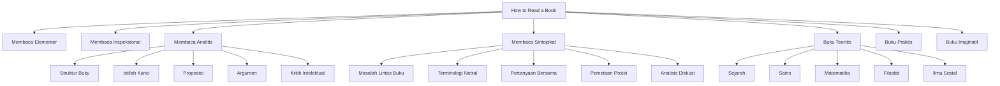

# How to Read a Book — Mortimer J. Adler & Charles Van Doren

## [[Membaca]] sebagai Aktivitas Intelektual

Dalam kerangka Adler dan Van Doren, [[membaca]] bukan sekadar menerima informasi tertulis. Membaca adalah aktivitas aktif untuk memperoleh pemahaman dari teks yang awalnya berada di luar jangkauan pemahaman pembaca.

Ada perbedaan mendasar antara membaca untuk **informasi** dan membaca untuk **pemahaman**.

Membaca untuk informasi terjadi ketika pembaca sudah memiliki kerangka pengetahuan yang cukup untuk menerima isi teks tanpa banyak perubahan dalam struktur pikirannya. Teks hanya menambahkan data, fakta, contoh, atau berita baru ke dalam sesuatu yang sudah relatif dimengerti.

Membaca untuk pemahaman terjadi ketika teks berada di atas tingkat pemahaman awal pembaca. Di sini, pembaca tidak hanya menyerap isi, tetapi berusaha naik ke tingkat pengertian yang lebih tinggi. Buku menjadi semacam lawan bicara intelektual yang lebih kuat, dan pembaca harus bekerja untuk mengejar struktur pikirannya. Manusia, dengan segala drama kognitifnya, ternyata perlu diingatkan bahwa membaca bukan cuma menatap huruf sambil merasa produktif.

> [!important]  
> Membaca yang bernilai intelektual adalah proses menaikkan kemampuan memahami, bukan sekadar menambah simpanan informasi.

Dalam pengertian ini, membaca adalah seni menemukan apa yang ingin dikatakan penulis, bagaimana ia menyusunnya, mengapa ia mengatakannya, dan sejauh mana pernyataannya benar atau penting.

---

## Hubungan antara [[Pembaca]], [[Buku]], dan [[Penulis]]

Buku dipahami sebagai media komunikasi antara penulis dan pembaca. Namun komunikasi ini tidak berlangsung secara langsung. Penulis tidak hadir untuk menjelaskan ulang, memperbaiki salah paham, atau menjawab pertanyaan spontan. Karena itu, pembaca harus melakukan pekerjaan interpretatif secara mandiri.

Hubungan ini memiliki tiga unsur utama:

1. **Penulis** sebagai pihak yang menyusun gagasan.
    
2. **Buku** sebagai struktur bahasa yang membawa gagasan.
    
3. **Pembaca** sebagai pihak yang harus menemukan, menafsirkan, menilai, dan menghubungkan gagasan itu.
    

Buku bukan tumpukan kalimat yang berdiri sendiri. Buku adalah satu kesatuan terorganisasi. Bab, bagian, argumen, contoh, istilah, dan kesimpulan penulis harus dipahami sebagai bagian dari struktur keseluruhan. Pembaca yang hanya menangkap fragmen akan mudah merasa telah mengerti, padahal yang dimengerti hanya serpihan. Peradaban rupanya dibangun di atas banyak orang yang mengutip serpihan dengan percaya diri.

---

## [[Seni Membaca]] dan Keterampilan Aktif

Adler dan Van Doren menempatkan membaca sejajar dengan keterampilan aktif lain. Seperti menulis, berbicara, atau mendengarkan secara kritis, membaca membutuhkan aturan, disiplin, dan latihan intelektual. Tetapi dalam catatan ini, yang penting adalah struktur gagasannya: membaca memiliki tingkatan, prosedur, dan tujuan yang berbeda-beda.

Membaca aktif berarti pembaca terus mengajukan pertanyaan kepada teks. Pertanyaan ini bukan gangguan, melainkan alat untuk menemukan organisasi gagasan. Pembaca tidak boleh memperlakukan teks seolah semua kalimat memiliki bobot yang sama. Ada kalimat utama, istilah kunci, argumen inti, premis tersembunyi, contoh pendukung, dan bagian tambahan.

> [!note]  
> Buku yang baik menuntut pembaca bekerja. Bila pembaca tidak bekerja, buku itu hanya menjadi benda cetak dengan reputasi bagus.

Membaca aktif juga berarti membuat tanda, catatan, dan struktur ulang pemahaman. Adler dan Van Doren memandang menandai buku sebagai bentuk dialog dengan penulis. Namun tanda dan catatan bukan dekorasi akademik. Ia berguna hanya jika membantu menangkap struktur, istilah, dan argumentasi.

---

## Empat Tingkat [[Membaca]]

Adler dan Van Doren membagi membaca menjadi empat tingkat utama. Tingkat ini bukan sekadar kategori terpisah, melainkan susunan bertingkat. Tingkat yang lebih tinggi mengandaikan penguasaan tingkat di bawahnya.

|Tingkat Membaca|Fokus Utama|Pertanyaan Dasar|
|---|---|---|
|[[Membaca Elementer]]|Mengenali bahasa tertulis|Apa yang dikatakan kalimat ini?|
|[[Membaca Inspeksional]]|Menangkap bentuk dan isi umum buku|Buku ini tentang apa secara keseluruhan?|
|[[Membaca Analitis]]|Memahami buku secara mendalam|Apa struktur, istilah, argumen, dan kebenaran buku ini?|
|[[Membaca Sintopikal]]|Membaca banyak buku tentang satu persoalan|Bagaimana berbagai penulis membahas masalah yang sama?|

Keempat tingkat ini memperlihatkan bahwa membaca bukan aktivitas tunggal. Membaca novel ringan, membaca laporan teknis, membaca filsafat, membaca sejarah, dan membaca buku ilmiah tidak menuntut cara kerja yang sama. Menggunakan satu cara baca untuk semua buku adalah bentuk penghematan mental yang mahal akibatnya.

---

# [[Membaca Elementer]]

## Hakikat Membaca Elementer

[[Membaca Elementer]] adalah tingkat dasar membaca. Pada tingkat ini, persoalan utama adalah kemampuan mengenali kata, kalimat, struktur gramatikal, dan makna literal. Pertanyaan dasarnya adalah: **apa arti kalimat ini?**

Tingkat ini biasanya dikaitkan dengan pembelajaran membaca pada masa awal pendidikan. Namun Adler dan Van Doren tidak membahasnya hanya sebagai urusan anak-anak. Orang dewasa pun dapat mengalami hambatan elementer ketika berhadapan dengan bahasa asing, istilah teknis, struktur kalimat rumit, atau teks yang secara linguistik padat.

Membaca elementer mencakup:

- mengenali kata;
    
- memahami hubungan kata dalam kalimat;
    
- menangkap arti literal;
    
- mengikuti urutan kalimat;
    
- memahami rujukan dasar;
    
- membedakan pernyataan, pertanyaan, perintah, dan penjelasan.
    

Pada tingkat ini, pembaca belum terutama menilai argumen. Ia masih berusaha memahami apa yang dikatakan teks secara langsung.

---

## Batas Membaca Elementer

Kekeliruan umum dalam budaya membaca adalah menganggap bahwa kemampuan membaca elementer sudah cukup untuk membaca semua jenis buku. Seseorang yang dapat melafalkan teks dan memahami arti kalimat belum tentu dapat memahami buku sebagai satu kesatuan argumen.

Buku yang serius biasanya tidak hanya menyampaikan kalimat-kalimat yang bisa dipahami satu per satu. Ia membangun jaringan makna. Jika pembaca berhenti pada tingkat elementer, ia dapat memahami bagian-bagian kecil tanpa memahami bangunan besarnya.

Misalnya, seseorang dapat mengerti arti setiap kalimat dalam buku filsafat politik, tetapi gagal melihat pertanyaan utama, tesis, definisi konsep, perbedaan posisi, atau konsekuensi argumennya. Hurufnya terbaca, pikirannya tidak.

---

# [[Membaca Inspeksional]]

## Fungsi Membaca Inspeksional

[[Membaca Inspeksional]] adalah membaca untuk memperoleh gambaran menyeluruh dalam waktu terbatas. Tujuannya bukan memahami semua detail, melainkan menemukan bentuk umum buku: topik, struktur, jenis, arah argumen, dan tingkat relevansinya.

Pada tingkat ini, pembaca berusaha menjawab: **buku ini secara keseluruhan tentang apa?**

Membaca inspeksional penting karena tidak semua buku layak dibaca secara analitis. Sebagian buku cukup dibaca cepat; sebagian lain membutuhkan pembacaan mendalam; sebagian lagi tidak relevan dengan kebutuhan intelektual tertentu. Tanpa inspeksi, pembaca mudah terjebak memperlakukan semua teks seolah memiliki nilai dan tuntutan yang sama.

Adler dan Van Doren menekankan bahwa membaca cepat bukan sekadar mempercepat gerak mata. Membaca cepat yang bermakna adalah kemampuan menyesuaikan kecepatan dengan nilai bagian yang sedang dibaca.

---

## Inspeksi Sistematis terhadap Buku

Dalam membaca inspeksional, pembaca memperhatikan bagian-bagian luar dan struktur formal buku. Unsur yang biasanya diamati meliputi:

- judul dan subjudul;
    
- daftar isi;
    
- kata pengantar;
    
- indeks;
    
- bab pembuka dan penutup;
    
- ringkasan bab jika ada;
    
- susunan subbab;
    
- istilah yang sering muncul;
    
- bagian yang tampak menjadi pusat argumen.
    

Judul sering memberi petunjuk tentang subjek dan sudut pandang. Daftar isi menunjukkan struktur organisasi. Indeks memperlihatkan konsep yang dianggap penting. Kata pengantar dapat menjelaskan tujuan penulis, konteks penulisan, atau batas pembahasan.

Namun unsur-unsur ini tidak boleh diterima mentah-mentah. Judul bisa menyesatkan, pengantar bisa terlalu defensif, dan daftar isi bisa tampak rapi meskipun argumen buku berantakan. Ya, bahkan buku juga bisa berpura-pura terorganisasi, seperti rapat manusia pada umumnya.

---

## Membaca Superfisial yang Disengaja

Adler dan Van Doren membedakan membaca dangkal karena malas dari membaca superfisial yang disengaja. Dalam pembacaan pertama terhadap buku sulit, pembaca dianjurkan melewati bagian yang belum dipahami sepenuhnya dan terus bergerak sampai memperoleh gambaran umum.

Ini bukan berarti mengabaikan kesulitan. Ini berarti menunda penyelesaian kesulitan sampai struktur umum buku terlihat. Banyak bagian sulit baru menjadi jelas setelah pembaca mengetahui arah keseluruhan buku.

> [!note]  
> Pada bacaan pertama, tugas utama sering kali bukan menguasai semua detail, melainkan menemukan medan intelektual tempat detail itu berada.

Pembacaan superfisial berguna terutama untuk buku yang padat, klasik, teknis, atau argumentatif. Jika pembaca berhenti terlalu lama pada setiap kesulitan awal, ia dapat kehilangan bentuk keseluruhan. Dengan membaca terus, pembaca memperoleh peta awal yang nanti digunakan dalam pembacaan analitis.

---

# [[Membaca Analitis]]

## Kedudukan Membaca Analitis

[[Membaca Analitis]] adalah tingkat membaca yang paling lengkap untuk satu buku. Tujuannya adalah memahami buku sebaik mungkin menurut struktur dan tujuan buku itu sendiri.

Pada tingkat ini, pembaca tidak hanya bertanya “apa isi buku ini?”, tetapi juga:

- apa jenis buku ini;
    
- apa masalah utama yang dibahas;
    
- bagaimana buku disusun;
    
- istilah apa yang menjadi kunci;
    
- proposisi apa yang diajukan;
    
- argumen apa yang mendukungnya;
    
- masalah apa yang berhasil atau gagal diselesaikan;
    
- sejauh mana pembaca setuju dengan penulis.
    

Membaca analitis bersifat menuntut. Pembaca harus cukup rendah hati untuk memahami sebelum menilai, tetapi cukup kritis untuk tidak sekadar tunduk pada otoritas penulis.

---

## Tahap Pertama Membaca Analitis: Menemukan Struktur Buku

Tahap pertama membaca analitis berhubungan dengan pengenalan bentuk keseluruhan buku. Sebuah buku harus ditempatkan dalam jenis tertentu, lalu dipahami sebagai satu kesatuan yang tersusun.

### Mengklasifikasikan Buku

Pembaca perlu mengetahui jenis buku yang sedang dibaca. Buku teoritis berbeda dari buku praktis. Buku filsafat berbeda dari buku sains. Buku sejarah berbeda dari buku matematika. Buku sastra berbeda dari buku ekspositori.

Klasifikasi ini penting karena setiap jenis buku memiliki cara kebenaran dan cara pembuktian yang berbeda. Buku matematika menuntut demonstrasi formal. Buku sejarah bergantung pada bukti peristiwa dan interpretasi. Buku filsafat bekerja melalui analisis konsep dan argumen. Buku praktis bertujuan mengarahkan tindakan.

|Jenis Buku|Orientasi|Bentuk Pertanyaan|
|---|---|---|
|Teoritis|Mengetahui sesuatu|Apa yang benar?|
|Praktis|Melakukan sesuatu|Apa yang harus dilakukan?|
|Imajinatif|Mengalami dunia rekaan|Apa pengalaman yang dibentuk teks?|

Klasifikasi yang salah menghasilkan cara baca yang salah. Membaca puisi seperti membaca laporan laboratorium sama menyedihkannya dengan membaca laporan laboratorium seperti puisi, meski yang kedua mungkin menjelaskan banyak rapat kantor.

---

### Menyatakan Kesatuan Buku

Setelah mengetahui jenis buku, pembaca harus menangkap kesatuan buku. Kesatuan ini dapat dirumuskan sebagai pokok utama atau masalah sentral yang menyatukan semua bagian.

Sebuah buku yang baik tidak hanya berisi kumpulan topik. Ia memiliki pusat gravitasi. Semua bagian pentingnya berhubungan dengan pusat itu. Pembaca analitis perlu menemukan hubungan antara tema besar dan rincian bab.

Dalam catatan Obsidian, konsep ini dapat dipahami sebagai hubungan antara `[[Tema Utama]]`, `[[Masalah Sentral]]`, dan `[[Struktur Argumen]]`.

---

### Memetakan Bagian-Bagian Buku

Buku harus dipahami sebagai organisasi bagian. Pembaca perlu melihat bagaimana bab, subbab, dan argumen kecil mendukung tujuan besar buku.

Struktur ini dapat berupa:

- pembagian topik;
    
- urutan historis;
    
- urutan logis;
    
- urutan dari masalah ke solusi;
    
- urutan dari prinsip ke penerapan;
    
- urutan dari definisi ke pembuktian;
    
- urutan dari kritik terhadap posisi lain menuju posisi penulis sendiri.
    

Memetakan buku bukan membuat daftar isi ulang. Yang dicari adalah fungsi setiap bagian dalam keseluruhan. Bab tertentu bisa berfungsi sebagai pembukaan masalah, bab lain sebagai definisi istilah, bab lain sebagai pembelaan tesis, dan bab lain sebagai penerapan.

---

### Menemukan Masalah yang Ingin Diselesaikan Penulis

Menurut Adler dan Van Doren, penulis biasanya menulis karena ada pertanyaan atau masalah yang hendak dijawab. Pembaca perlu menemukan masalah tersebut.

Masalah ini bisa eksplisit, tetapi sering juga tersembunyi. Dalam buku filsafat, masalah bisa berupa “apa itu keadilan?” atau “apa dasar pengetahuan manusia?” Dalam buku politik, masalah bisa berupa “bagaimana kekuasaan sah dibentuk?” Dalam buku sains, masalah bisa berupa “apa penyebab fenomena tertentu?”

Membaca analitis menuntut pembaca memahami buku sebagai jawaban terhadap pertanyaan tertentu, bukan sebagai kumpulan pernyataan tanpa asal-usul.

---

## Tahap Kedua Membaca Analitis: Menafsirkan Isi Buku

Tahap kedua berhubungan dengan interpretasi. Setelah struktur ditemukan, pembaca perlu memahami istilah, proposisi, dan argumen penulis.

---

## [[Istilah Kunci]]

Istilah adalah kata yang dipakai dengan makna tertentu dalam konteks argumen. Tidak semua kata dalam buku sama penting. Beberapa kata adalah pusat konsep. Kata-kata ini harus dipahami dengan tepat karena seluruh argumen dapat bergantung padanya.

Adler dan Van Doren membedakan antara **kata** dan **istilah**. Kata adalah bentuk bahasa. Istilah adalah kata yang dipakai dengan makna konseptual tertentu. Satu kata dapat memiliki beberapa istilah jika digunakan dengan makna berbeda. Sebaliknya, satu istilah dapat diungkapkan melalui beberapa kata.

Misalnya, dalam buku politik, kata “kebebasan” dapat berarti kebebasan dari paksaan, kemampuan bertindak, hak hukum, otonomi moral, atau kondisi sosial tertentu. Jika pembaca tidak mengetahui makna yang dipakai penulis, ia akan mengira paham padahal hanya mengenali kata.

> [!important]  
> Kesepakatan makna antara penulis dan pembaca adalah syarat dasar pemahaman.

Dalam membaca analitis, pembaca harus menemukan kata-kata penting, lalu menentukan makna teknisnya dalam buku tersebut. Ini terutama penting dalam filsafat, sains, matematika, teologi, hukum, dan teori sosial, yaitu wilayah tempat satu kata bisa membawa satu koper metafisika yang merepotkan.

---

## [[Proposisi]]

Proposisi adalah pernyataan bermakna yang mengandung klaim. Dalam buku, proposisi sering diwujudkan dalam kalimat, tetapi kalimat dan proposisi tidak identik. Satu kalimat dapat mengandung beberapa proposisi. Satu proposisi dapat dinyatakan dalam beberapa kalimat berbeda.

Pembaca analitis harus menemukan kalimat-kalimat penting yang memuat klaim utama penulis. Tidak semua kalimat memiliki status yang sama. Sebagian hanya ilustrasi, transisi, pengulangan, atau penjelasan tambahan.

Proposisi utama biasanya menjawab pertanyaan seperti:

- apa yang dinyatakan penulis sebagai benar;
    
- apa yang ditolak penulis;
    
- apa hubungan antara konsep-konsep utama;
    
- apa prinsip yang dipakai penulis;
    
- apa konsekuensi dari argumen penulis.
    

Memahami proposisi berarti memahami klaim, bukan sekadar mengingat kalimat.

---

## [[Argumen]]

Argumen adalah rangkaian proposisi yang disusun untuk mendukung proposisi lain. Dalam membaca analitis, pembaca harus mengetahui bagaimana penulis bergerak dari alasan menuju kesimpulan.

Argumen dapat berbentuk deduktif, induktif, analogis, historis, konseptual, atau kausal. Buku yang berbeda menuntut cara pembacaan argumen yang berbeda pula.

Dalam buku filsafat, argumen sering bergantung pada definisi dan pembedaan konsep. Dalam buku sains, argumen bergantung pada observasi, eksperimen, dan generalisasi. Dalam buku sejarah, argumen bergantung pada sumber, kronologi, dan interpretasi sebab-akibat. Dalam buku praktis, argumen sering bergerak dari tujuan menuju cara bertindak.

Pembaca tidak cukup mengetahui “penulis setuju dengan X”. Ia harus mengetahui alasan mengapa penulis setuju dengan X, premis apa yang menopang persetujuan itu, dan apakah hubungan antara premis dan kesimpulan cukup kuat.

---

## Menentukan Bagian yang Sudah dan Belum Dipahami

Membaca analitis mengharuskan pembaca membedakan antara pemahaman nyata dan rasa akrab palsu. Banyak pembaca merasa memahami buku karena mengenali istilah atau pernah mendengar topiknya. Ini belum pemahaman.

Tanda pemahaman yang lebih kuat adalah kemampuan menjelaskan struktur buku dengan bahasa sendiri, menunjukkan istilah kunci, merumuskan proposisi utama, dan melacak argumen. Namun catatan ini bukan tempat membuat tugas untuk pembaca, jadi cukup dicatat sebagai kriteria konseptual.

Ketidakpahaman juga harus dilokalisasi. Pembaca perlu tahu apakah ia tidak memahami istilah, proposisi, hubungan antarbagian, bukti, atau tujuan penulis. Ketidakpahaman yang tidak diberi bentuk akan berubah menjadi kabut intelektual, dan kabut sering disalahartikan sebagai kedalaman.

---

## Tahap Ketiga Membaca Analitis: Mengkritik Buku

Tahap ketiga membaca analitis adalah kritik. Namun kritik hanya sah setelah pembaca memahami buku. Adler dan Van Doren menolak kebiasaan menilai terlalu cepat. Penilaian sebelum pemahaman adalah reaksi, bukan kritik.

Kritik dalam kerangka ini bukan sekadar mencari kelemahan. Kritik berarti menilai kebenaran, kelengkapan, dan signifikansi buku. Pembaca dapat setuju, tidak setuju, atau menunda penilaian, tetapi semuanya harus didasarkan pada pemahaman terhadap struktur dan argumen penulis.

---

## Etika Intelektual dalam Kritik

Ada prinsip penting: pembaca harus dapat mengatakan “saya memahami” sebelum mengatakan “saya setuju” atau “saya tidak setuju”. Ini bukan kesopanan kosong. Ini syarat agar perbedaan pendapat berada pada tingkat gagasan, bukan pada karikatur gagasan.

Kritik yang baik menghindari beberapa cacat intelektual:

- menolak karena tidak suka gaya penulis;
    
- menyetujui karena reputasi penulis;
    
- menyerang posisi yang tidak benar-benar dikemukakan;
    
- mengutip bagian terpisah dari struktur argumen;
    
- mencampurkan ketidaktahuan pribadi dengan kesalahan penulis;
    
- menganggap sulit berarti salah;
    
- menganggap jelas berarti benar.
    

Adler dan Van Doren juga menekankan pentingnya membedakan antara perselisihan nyata dan perselisihan verbal. Dua pihak mungkin tampak berbeda pendapat hanya karena memakai istilah dengan makna berbeda. Sebelum menilai, pembaca harus memastikan bahwa ia dan penulis berbicara tentang hal yang sama.

---

## Bentuk-Bentuk Ketidaksetujuan yang Sah

Dalam kerangka Adler dan Van Doren, pembaca yang tidak setuju dengan penulis harus memiliki dasar. Ketidaksetujuan bukan suasana hati. Ada beberapa bentuk keberatan intelektual yang sah.

### Penulis Kurang Informasi

Penulis dapat dikritik jika ia tidak mengetahui fakta atau bukti yang relevan bagi persoalan yang dibahas. Ini sering terjadi pada buku lama yang ditulis sebelum perkembangan pengetahuan tertentu.

Namun keberatan ini hanya berlaku jika informasi yang hilang memang penting bagi argumen. Tidak mengetahui fakta tambahan yang tidak relevan bukan kelemahan substansial.

---

### Penulis Salah Informasi

Penulis dapat dikritik jika ia menggunakan informasi yang keliru. Kesalahan fakta dapat merusak argumen, terutama jika fakta tersebut menjadi premis penting.

Kesalahan informasi berbeda dari perbedaan interpretasi. Dalam sejarah, misalnya, fakta dasar dan penafsiran terhadap fakta harus dibedakan. Jika penulis salah tanggal, salah sumber, atau salah data, itu satu hal. Jika ia menafsirkan akibat politik suatu peristiwa secara berbeda, itu hal lain.

---

### Penulis Tidak Logis

Penulis dapat dikritik jika argumennya tidak mengikuti hubungan rasional yang sah. Ini meliputi kesimpulan yang tidak ditopang premis, kontradiksi internal, generalisasi tergesa-gesa, atau pergeseran makna istilah.

Ketidaklogisan tidak selalu terlihat sebagai kekacauan terang-terangan. Kadang buku tampak fasih, sistematis, bahkan elegan, tetapi argumen intinya melompat. Bahasa yang rapi sering menjadi pakaian formal bagi pikiran yang sedang kabur.

---

### Analisis Penulis Tidak Lengkap

Sebuah buku dapat benar dalam hal yang dikatakannya, tetapi belum lengkap dalam cakupan masalahnya. Penulis mungkin mengabaikan aspek penting, tidak menjawab keberatan tertentu, atau membatasi persoalan terlalu sempit.

Kritik jenis ini tidak selalu membatalkan buku. Ia menunjukkan batas buku. Banyak karya besar tetap penting meskipun tidak menyelesaikan seluruh persoalan. Buku dapat menjadi benar tetapi tidak cukup lengkap.

---

## Setuju, Tidak Setuju, dan Menunda Penilaian

Adler dan Van Doren memberi ruang bagi tiga posisi pembaca setelah memahami buku:

1. **Setuju**, jika argumen penulis kuat dan pembaca menerima kesimpulannya.
    
2. **Tidak setuju**, jika pembaca menemukan alasan yang sah untuk menolak.
    
3. **Menunda penilaian**, jika pembaca belum memiliki dasar cukup untuk menerima atau menolak.
    

Menunda penilaian bukan kelemahan. Dalam banyak perkara, terutama yang kompleks, suspensi penilaian adalah bentuk disiplin intelektual. Dunia mungkin akan sedikit lebih waras jika manusia tidak merasa wajib punya opini final setelah membaca dua paragraf dan satu unggahan marah.

---

# Empat Pertanyaan Dasar dalam [[Membaca Analitis]]

Adler dan Van Doren merumuskan empat pertanyaan yang membentuk inti membaca analitis. Di sini pertanyaan tersebut diperlakukan sebagai struktur materi, bukan daftar tugas.

## Apa yang Dibahas Buku secara Keseluruhan?

Pertanyaan ini menyangkut kesatuan buku. Pembaca harus mengetahui tema utama, persoalan sentral, dan jenis buku. Jawaban terhadap pertanyaan ini menghasilkan pemahaman tentang buku sebagai totalitas.

Ini berkaitan dengan:

- klasifikasi buku;
    
- tema utama;
    
- masalah yang diajukan;
    
- struktur besar;
    
- hubungan antarbagian.
    

---

## Apa yang Dikatakan Buku secara Terperinci?

Pertanyaan ini menyangkut interpretasi isi. Pembaca perlu menemukan istilah kunci, proposisi utama, dan argumen. Di sini buku dibaca bukan sebagai permukaan narasi, tetapi sebagai sistem pernyataan.

Ini berkaitan dengan:

- istilah penting;
    
- definisi eksplisit dan implisit;
    
- klaim utama;
    
- alasan pendukung;
    
- struktur argumentatif;
    
- hubungan premis dan kesimpulan.
    

---

## Apakah Buku Itu Benar?

Pertanyaan ini menyangkut penilaian. Kebenaran buku tidak dapat dinilai hanya dari gaya, reputasi, atau pengaruh historisnya. Pembaca harus menilai kecukupan bukti, konsistensi logika, akurasi informasi, dan kekuatan argumen.

Kebenaran di sini juga bergantung pada jenis buku. Kebenaran dalam matematika berbeda dari kebenaran dalam sejarah. Kebenaran dalam buku praktis berbeda dari kebenaran dalam buku metafisika.

---

## Apa Arti Pentingnya?

Pertanyaan ini menyangkut signifikansi. Sebuah buku bisa benar tetapi tidak penting, atau penting meskipun sebagian argumennya lemah. Signifikansi berkaitan dengan dampak gagasan terhadap pemahaman, perdebatan, ilmu, tindakan, atau tradisi pemikiran.

Pertanyaan ini menempatkan buku dalam jaringan pengetahuan yang lebih luas. Buku tidak hanya dinilai sebagai objek tertutup, tetapi juga sebagai kontribusi terhadap percakapan intelektual.

---

# [[Buku Teoritis]] dan [[Buku Praktis]]

## Perbedaan Dasar

Adler dan Van Doren membedakan buku teoritis dan buku praktis. Perbedaan ini penting karena tujuan membaca keduanya berbeda.

[[Buku Teoritis]] bertujuan menyampaikan pengetahuan tentang apa yang benar. Buku ini menjelaskan, membuktikan, menafsirkan, atau menganalisis kenyataan.

[[Buku Praktis]] bertujuan mengarahkan tindakan. Buku ini membahas apa yang sebaiknya dilakukan, bagaimana sesuatu dikerjakan, atau prinsip apa yang seharusnya memandu tindakan.

|Aspek|Buku Teoritis|Buku Praktis|
|---|---|---|
|Tujuan|Mengetahui|Bertindak|
|Pertanyaan utama|Apa yang benar?|Apa yang harus dilakukan?|
|Ukuran keberhasilan|Pemahaman terhadap kenyataan|Arah tindakan yang masuk akal|
|Bentuk argumen|Penjelasan dan pembuktian|Tujuan, cara, norma, keputusan|

Buku praktis tidak otomatis lebih rendah daripada buku teoritis. Ia hanya memiliki orientasi berbeda. Buku etika, politik, ekonomi kebijakan, pendidikan, dan manajemen sering berada dalam wilayah praktis karena berkaitan dengan tindakan manusia.

---

## Struktur Buku Praktis

Buku praktis biasanya mengandung unsur tujuan dan sarana. Penulis tidak hanya menjelaskan keadaan, tetapi mengarahkan pembaca pada tindakan tertentu. Karena itu, pembaca harus memperhatikan nilai, norma, dan asumsi tujuan yang digunakan.

Buku praktis sering memuat pernyataan seperti:

- sesuatu sebaiknya dilakukan;
    
- suatu tindakan lebih baik daripada tindakan lain;
    
- tujuan tertentu layak dikejar;
    
- cara tertentu efektif untuk mencapai tujuan;
    
- prinsip tertentu harus menjadi pedoman.
    

Dalam buku praktis, penilaian tidak hanya menyangkut benar atau salah secara deskriptif, tetapi juga layak atau tidaknya tujuan, serta masuk akal atau tidaknya sarana.

---

## Struktur Buku Teoritis

Buku teoritis berfokus pada pengetahuan. Adler dan Van Doren membaginya lagi ke dalam beberapa jenis, terutama sejarah, sains, matematika, dan filsafat. Masing-masing memiliki cara kerja berbeda.

Buku teoritis menuntut pembaca menemukan:

- masalah yang diselidiki;
    
- konsep yang digunakan;
    
- pernyataan yang diajukan;
    
- bentuk bukti;
    
- batas pengetahuan yang diklaim;
    
- hubungan buku dengan bidang pengetahuan tertentu.
    

Buku teoritis tidak meminta tindakan langsung. Ia meminta pemahaman. Tentu saja, manusia kemudian tetap akan mengubah pemahaman menjadi debat melelahkan di ruang publik, karena begitulah spesies ini mengisi waktu.

---

# Membaca [[Buku Imajinatif]]

## Perbedaan Membaca Ekspositori dan Imajinatif

Adler dan Van Doren membedakan buku ekspositori dari karya imajinatif. Buku ekspositori menyampaikan pengetahuan secara langsung melalui konsep, proposisi, dan argumen. Karya imajinatif, seperti novel, drama, dan puisi, menyampaikan pengalaman yang dibentuk melalui bahasa, tokoh, peristiwa, citra, dan struktur artistik.

Membaca karya imajinatif tidak sama dengan membaca buku filsafat atau sains. Dalam karya imajinatif, pembaca tidak terutama mencari proposisi untuk dibuktikan. Pembaca memasuki dunia yang dibangun teks dan memahami pengalaman yang disusun oleh pengarang.

---

## Prinsip Membaca Sastra Imajinatif

Dalam karya imajinatif, pembaca perlu menerima dunia yang diciptakan pengarang sejauh dunia itu konsisten menurut aturan internalnya. Pertanyaan utama bukan “apakah ini benar secara faktual?”, melainkan “apa pengalaman manusia, konflik, pola, atau visi dunia yang dibentuk oleh karya ini?”

Novel, drama, dan puisi tidak bekerja terutama melalui argumen eksplisit. Ia bekerja melalui:

- alur;
    
- karakter;
    
- dialog;
    
- suasana;
    
- simbol;
    
- konflik;
    
- ironi;
    
- sudut pandang;
    
- ritme bahasa;
    
- struktur pengalaman.
    

Karya imajinatif harus dibaca sebagai keseluruhan. Memisahkan “pesan” dari bentuk dapat merusak pemahaman. Dalam sastra, bentuk bukan wadah netral bagi isi. Bentuk adalah bagian dari makna.

---

## Membaca Novel

Novel membentuk dunia naratif yang luas. Pembaca perlu memahami alur, karakter, latar, konflik, dan pola perkembangan. Namun unsur-unsur ini tidak boleh diperlakukan sebagai daftar mekanis. Nilainya terletak pada bagaimana semuanya membentuk pengalaman total.

Dalam novel, karakter bukan hanya “orang fiktif”. Karakter adalah pusat tindakan, konflik, dan perubahan. Alur bukan hanya urutan kejadian, melainkan susunan yang memberi bentuk pada sebab-akibat, ketegangan, dan makna.

Novel sering menyampaikan pemahaman tentang manusia bukan dengan definisi, tetapi dengan representasi pengalaman. Ia menunjukkan kompleksitas moral, ketidakjelasan motif, keterbatasan pengetahuan diri, dan benturan antara hasrat pribadi dan tatanan sosial.

---

## Membaca Drama

Drama ditulis untuk dipentaskan. Karena itu, pembacaan drama perlu memperhatikan tindakan, dialog, konflik panggung, dan hubungan antar tokoh dalam ruang dramatik.

Berbeda dari novel, drama biasanya tidak memberikan akses naratif luas ke pikiran tokoh. Karakter harus dipahami melalui ucapan, tindakan, jeda, dan interaksi. Bahasa dalam drama bersifat performatif: ia bukan hanya menyampaikan informasi, tetapi menggerakkan tindakan.

Dalam drama, struktur adegan penting. Setiap adegan mengubah relasi, ketegangan, atau arah konflik. Membaca drama sebagai teks murni tanpa membayangkan performanya akan mengurangi sebagian dimensinya.

---

## Membaca Puisi

Puisi menuntut perhatian khusus pada bahasa. Makna puisi tidak hanya berada pada pernyataan literal, tetapi juga pada irama, citra, bunyi, metafora, susunan baris, dan ketegangan antara makna eksplisit dan implisit.

Puisi sering padat dan tidak dapat diparafrasekan sepenuhnya tanpa kehilangan nilai. Parafrase dapat membantu menjelaskan makna dasar, tetapi tidak menggantikan pengalaman puisi. Ini ironis, mengingat manusia sering meminta “maksud puisi itu apa?” seolah puisi adalah laporan pajak yang sedang menyamar.

Adler dan Van Doren menekankan bahwa membaca puisi sering membutuhkan pembacaan berulang dan perhatian terhadap keseluruhan bentuk.

---

# Membaca [[Sejarah]]

## Hakikat Buku Sejarah

Sejarah bukan sekadar catatan fakta masa lalu. Buku sejarah adalah interpretasi terhadap peristiwa berdasarkan bukti, pilihan sudut pandang, dan kerangka penjelasan tertentu.

Sejarawan memilih peristiwa, menentukan hubungan sebab-akibat, menilai signifikansi, dan menyusun narasi. Karena itu, membaca sejarah menuntut perhatian terhadap fakta sekaligus interpretasi.

Buku sejarah memiliki dua dimensi:

1. **Dimensi faktual**, yaitu apa yang terjadi.
    
2. **Dimensi interpretatif**, yaitu bagaimana peristiwa itu dipahami dan diberi makna.
    

---

## Membaca Sejarah sebagai Narasi dan Argumen

Sejarah sering berbentuk narasi, tetapi narasi itu membawa argumen. Urutan peristiwa, pilihan tokoh, penekanan sebab, dan bahasa evaluatif menunjukkan cara sejarawan memahami masa lalu.

Pembaca sejarah perlu memperhatikan:

- periode yang dibahas;
    
- sumber yang digunakan;
    
- pertanyaan historis utama;
    
- sebab yang dianggap penting;
    
- kelompok atau tokoh yang diberi perhatian;
    
- peristiwa yang dipinggirkan;
    
- hubungan antara fakta dan interpretasi.
    

Objektivitas sejarah bukan berarti tanpa sudut pandang. Objektivitas lebih berkaitan dengan kesetiaan terhadap bukti, kejujuran interpretatif, dan keterbukaan terhadap kompleksitas.

---

## Biografi dan Autobiografi

Biografi adalah sejarah kehidupan seseorang yang ditulis oleh orang lain. Autobiografi adalah kehidupan seseorang yang ditulis oleh dirinya sendiri. Keduanya memiliki kekhasan interpretatif.

Biografi bergantung pada sumber, sudut pandang penulis, dan seleksi peristiwa. Autobiografi memiliki akses langsung terhadap pengalaman batin penulis, tetapi juga rawan pembenaran diri, penghapusan, atau penyusunan identitas secara retrospektif.

Dalam membaca biografi, pembaca perlu melihat bagaimana kehidupan individu dikaitkan dengan konteks sosial, politik, intelektual, atau moral yang lebih luas. Biografi yang baik tidak hanya menceritakan “apa yang dilakukan seseorang”, tetapi menunjukkan bentuk kehidupan sebagai pola bermakna.

---

# Membaca [[Sains]] dan [[Matematika]]

## Membaca Buku Sains

Buku sains bertujuan menjelaskan fenomena melalui observasi, hipotesis, eksperimen, teori, dan generalisasi. Membaca sains membutuhkan perhatian terhadap metode, bukti, dan batas klaim.

Pembaca perlu membedakan antara:

- data;
    
- hipotesis;
    
- teori;
    
- hukum;
    
- model;
    
- spekulasi;
    
- interpretasi hasil.
    

Buku sains populer sering menyederhanakan argumen teknis. Penyederhanaan dapat berguna, tetapi juga dapat menyembunyikan kerumitan metode. Buku sains teknis menuntut pemahaman terhadap istilah khusus, prosedur, dan kadang matematika.

Kebenaran dalam sains bersifat terbuka terhadap revisi berdasarkan bukti baru. Karena itu, membaca buku sains juga melibatkan kesadaran historis: teori ilmiah berada dalam perkembangan.

---

## Membaca Matematika

Matematika berbeda dari banyak bentuk pengetahuan lain karena bergerak melalui definisi, aksioma, dan demonstrasi. Membaca matematika tidak dapat dilakukan seperti membaca narasi biasa.

Dalam matematika, satu baris dapat memadatkan banyak operasi pemikiran. Kecepatan membaca harus mengikuti struktur pembuktian, bukan jumlah halaman. Buku matematika menuntut pembaca memahami setiap langkah karena langkah berikutnya sering bergantung secara ketat pada langkah sebelumnya.

Adler dan Van Doren memperlakukan matematika sebagai contoh ekstrem dari membaca yang aktif. Pembaca tidak hanya menerima kesimpulan, tetapi harus mengikuti demonstrasi.

---

## Hubungan Sains dan Matematika

Dalam banyak ilmu modern, matematika menjadi bahasa formal untuk menyatakan hubungan. Namun membaca matematika dalam sains berbeda dari membaca matematika murni. Dalam sains, bentuk matematis biasanya terhubung dengan fenomena empiris. Dalam matematika murni, struktur formal dapat dipelajari tanpa rujukan langsung pada dunia fisik.

Perbedaan ini penting karena bukti matematis dan bukti empiris memiliki sifat berbeda. Bukti matematis menunjukkan keharusan logis dalam sistem tertentu. Bukti empiris menunjukkan dukungan observasional terhadap klaim tentang dunia.

---

# Membaca [[Filsafat]]

## Sifat Buku Filsafat

Buku filsafat berurusan dengan pertanyaan dasar tentang realitas, pengetahuan, nilai, bahasa, pikiran, masyarakat, Tuhan, kebebasan, keadilan, dan kehidupan baik. Filsafat sering tidak bergantung pada eksperimen laboratorium, melainkan pada analisis konsep, argumen rasional, dan pemeriksaan asumsi.

Membaca filsafat menuntut perhatian ketat terhadap istilah. Kata-kata sehari-hari seperti “ada”, “benar”, “baik”, “pikiran”, “sebab”, “bebas”, dan “adil” menjadi konsep teknis. Karena manusia rupanya menggunakan kata-kata besar setiap hari tanpa membaca manualnya, filsafat menjadi perlu.

---

## Pertanyaan Filosofis

Pertanyaan filosofis sering bersifat mendasar dan sulit diselesaikan secara final. Ia tidak selalu meminta informasi baru, tetapi kejernihan konseptual.

Contoh bentuk pertanyaan filosofis:

- apa hakikat sesuatu;
    
- bagaimana sesuatu dapat diketahui;
    
- apa dasar penilaian moral;
    
- apa hubungan antara tubuh dan pikiran;
    
- apa yang membuat tindakan sah;
    
- apa arti kebenaran;
    
- apakah manusia bebas.
    

Dalam buku filsafat, pembaca harus menemukan pertanyaan utama dan melihat bagaimana penulis membedakannya dari pertanyaan lain. Banyak argumen filsafat bergerak melalui pembedaan: antara pengetahuan dan opini, bentuk dan materi, substansi dan aksiden, analitik dan sintetik, kebebasan negatif dan positif, dan seterusnya.

---

## Gaya Argumen Filsafat

Argumen filsafat sering tidak berbentuk bukti empiris. Ia dapat berbentuk:

- analisis definisi;
    
- pembedaan konsep;
    
- reduksi terhadap kontradiksi;
    
- penalaran dari prinsip umum;
    
- kritik terhadap posisi lawan;
    
- pengujian konsekuensi logis;
    
- penyusunan sistem konseptual.
    

Pembaca filsafat harus sabar terhadap abstraksi. Namun abstraksi tidak boleh menjadi alasan untuk menerima kekaburan. Buku filsafat yang baik tetap harus dapat dipahami struktur argumennya, meskipun sulit.

---

## Perbedaan Filsafat dan Sains

Sains meneliti dunia melalui metode empiris. Filsafat meneliti konsep, prinsip, dan dasar pemahaman. Keduanya dapat saling berhubungan, tetapi tidak identik.

Pertanyaan “bagaimana otak bekerja?” adalah pertanyaan ilmiah. Pertanyaan “apa hubungan antara aktivitas otak dan kesadaran?” dapat menjadi pertanyaan filosofis jika menyangkut makna kesadaran, identitas diri, atau pengalaman subjektif.

Membaca filsafat dengan harapan menemukan data empiris akan mengecewakan. Membaca sains seolah ia menyelesaikan semua pertanyaan filosofis juga sama bermasalahnya.

---

# Membaca [[Ilmu Sosial]]

## Posisi Ilmu Sosial

Adler dan Van Doren melihat ilmu sosial sebagai wilayah yang sering lebih sulit dibaca daripada kelihatannya. Sosiologi, ekonomi, antropologi, ilmu politik, psikologi sosial, dan bidang serupa menggunakan bahasa yang tampak akrab, tetapi sering memuat konsep teknis dan asumsi metodologis.

Kesulitannya terletak pada campuran antara fakta, teori, nilai, kebijakan, dan interpretasi. Buku ilmu sosial sering membahas manusia, dan manusia adalah objek penelitian yang merepotkan karena juga membaca hasil penelitiannya lalu berubah perilaku, tentu saja demi memperumit pekerjaan semua orang.

---

## Bahasa dalam Ilmu Sosial

Ilmu sosial banyak menggunakan kata sehari-hari dengan makna teknis: kelas, status, peran, pasar, rasionalitas, norma, lembaga, budaya, kekuasaan, identitas, perilaku, struktur, agen.

Pembaca harus menemukan bagaimana penulis mendefinisikan istilah-istilah tersebut. Jika tidak, pembaca akan membawa makna sehari-hari ke dalam teori, lalu salah memahami argumen.

---

## Membaca Banyak Sumber dalam Ilmu Sosial

Adler dan Van Doren menekankan bahwa ilmu sosial sering menuntut pembacaan sintopikal karena banyak persoalan diperdebatkan oleh berbagai penulis dengan kerangka berbeda. Satu buku jarang cukup untuk memahami masalah sosial secara utuh.

Misalnya, topik seperti kemiskinan, demokrasi, pendidikan, keluarga, birokrasi, atau kapitalisme biasanya dibahas dari banyak perspektif. Pembaca perlu membandingkan istilah, data, metode, dan nilai yang digunakan para penulis.

---

# [[Membaca Sintopikal]]

## Hakikat Membaca Sintopikal

[[Membaca Sintopikal]] adalah tingkat membaca tertinggi dalam kerangka Adler dan Van Doren. Pada tingkat ini, pembaca tidak berpusat pada satu buku, tetapi pada satu persoalan yang dibahas oleh banyak buku.

Dalam membaca analitis, buku adalah pusat. Dalam membaca sintopikal, masalah adalah pusat. Buku-buku menjadi sumber yang membantu membangun pemahaman tentang persoalan tersebut.

> [!important]  
> Membaca sintopikal bukan membaca banyak buku secara terpisah, melainkan menyusun percakapan intelektual antarpenulis di sekitar satu masalah.

Pembaca sintopikal tidak membiarkan satu penulis menentukan seluruh kerangka pembahasan. Ia membandingkan berbagai penulis, menemukan istilah yang sepadan, mengidentifikasi pertanyaan bersama, dan menyusun posisi yang saling berhubungan.

---

## Perbedaan Membaca Analitis dan Sintopikal

|Aspek|Membaca Analitis|Membaca Sintopikal|
|---|---|---|
|Pusat perhatian|Satu buku|Satu masalah|
|Tujuan|Memahami buku sebaik mungkin|Memahami perdebatan lintas buku|
|Istilah|Mengikuti istilah penulis|Menyusun istilah netral pembaca|
|Struktur|Struktur buku|Struktur persoalan|
|Hasil intelektual|Pemahaman terhadap karya|Pemetaan posisi dalam diskusi|

Dalam membaca sintopikal, pembaca menjadi lebih aktif daripada dalam membaca analitis. Ia tidak hanya menafsirkan, tetapi juga mengonstruksi medan diskusi. Buku-buku tidak lagi menjadi otoritas tunggal; mereka menjadi peserta dalam percakapan.

---

## Tahap Persiapan Membaca Sintopikal

Sebelum membaca sintopikal secara penuh, pembaca perlu menemukan daftar buku yang relevan dan melakukan inspeksi terhadapnya. Tidak semua buku yang tampak berhubungan benar-benar penting. Sebagian hanya menyebut topik secara samping. Sebagian memakai istilah yang sama tetapi membahas persoalan berbeda.

Persiapan sintopikal melibatkan:

- menentukan wilayah persoalan;
    
- menemukan buku atau artikel relevan;
    
- memeriksa daftar isi dan indeks;
    
- mengidentifikasi bagian yang relevan;
    
- membedakan sumber utama dan tambahan.
    

Tahap ini bersifat eksploratif. Pembaca belum membangun analisis penuh, melainkan mengumpulkan bahan intelektual.

---

## Menemukan Bagian Relevan dalam Banyak Buku

Dalam membaca sintopikal, pembaca tidak selalu membaca setiap buku secara lengkap. Yang dicari adalah bagian yang relevan dengan persoalan. Ini berbeda dari membaca analitis, yang berusaha memahami buku sebagai keseluruhan.

Satu buku mungkin penting hanya pada satu bab. Buku lain mungkin berguna karena definisinya. Buku lain lagi penting karena kritiknya terhadap posisi tertentu. Pembaca sintopikal harus mengetahui bagian mana yang berkontribusi terhadap persoalan.

Ini bukan tindakan sembrono. Justru membaca sintopikal menuntut kecermatan untuk tidak memaksa seluruh buku masuk ke dalam persoalan yang sedang dibahas.

---

## Membangun Terminologi Netral

Salah satu langkah terpenting dalam membaca sintopikal adalah membangun istilah netral. Setiap penulis mungkin memakai istilah berbeda untuk gagasan yang mirip, atau memakai istilah sama dengan makna berbeda.

Jika pembaca membiarkan satu penulis menguasai bahasa diskusi, perbandingan menjadi bias. Karena itu, pembaca perlu membuat kosakata analitis yang memungkinkan berbagai posisi dibandingkan secara adil.

Contoh: dalam perdebatan politik, satu penulis mungkin memakai “liberty”, penulis lain “freedom”, penulis lain “autonomy”, dan penulis lain “non-domination”. Pembaca perlu menentukan apakah istilah-istilah ini merujuk pada konsep yang sama, beririsan, atau berbeda secara prinsip.

---

## Menentukan Pertanyaan yang Sama

Buku-buku jarang menjawab pertanyaan dengan bentuk yang persis sama. Pembaca sintopikal harus merumuskan pertanyaan yang dapat diajukan kepada semua penulis, bahkan jika mereka tidak menyatakannya secara eksplisit.

Pertanyaan ini harus cukup umum untuk mencakup berbagai buku, tetapi cukup tajam untuk menghasilkan perbedaan posisi.

Misalnya, dalam topik pendidikan, pertanyaan sintopikal dapat berupa:

- apa tujuan pendidikan;
    
- siapa yang berwenang menentukan kurikulum;
    
- bagaimana hubungan pendidikan dan kebebasan;
    
- apakah pendidikan terutama membentuk warga, pekerja, atau manusia utuh.
    

Pertanyaan semacam ini membentuk medan diskusi. Para penulis kemudian ditempatkan berdasarkan jawaban mereka, bukan berdasarkan urutan buku yang dibaca.

---

## Memetakan Perbedaan Posisi

Membaca sintopikal menghasilkan pemetaan posisi. Pembaca melihat di mana para penulis setuju, berbeda, bertentangan, atau berbicara melewati satu sama lain.

Perbedaan posisi dapat muncul pada berbagai tingkat:

- definisi istilah;
    
- asumsi dasar;
    
- fakta yang dianggap penting;
    
- nilai yang diprioritaskan;
    
- metode penalaran;
    
- kesimpulan praktis;
    
- batas persoalan.
    

Pemetaan ini tidak harus memaksa semua penulis masuk ke dalam dua kubu. Banyak perdebatan intelektual lebih kompleks daripada format “pro-kontra” yang disukai manusia karena otak lelah menghadapi spektrum.

---

## Analisis Diskusi

Tahap akhir membaca sintopikal adalah menganalisis diskusi itu sendiri. Pembaca tidak hanya bertanya “siapa benar?”, tetapi juga “bagaimana persoalan ini terstruktur?”, “mengapa para penulis berbeda?”, dan “apa yang belum diselesaikan?”

Analisis sintopikal dapat menunjukkan bahwa:

- para penulis berbeda karena memakai definisi berbeda;
    
- sebagian konflik bersifat faktual;
    
- sebagian konflik bersifat nilai;
    
- sebagian konflik berasal dari metode yang berbeda;
    
- beberapa pertanyaan belum dijawab oleh siapa pun;
    
- satu tradisi pemikiran mengabaikan aspek yang ditekankan tradisi lain.
    

Membaca sintopikal dengan demikian lebih dekat pada penelitian intelektual daripada membaca biasa.

---

# Peran [[Pertanyaan]] dalam Membaca

## Membaca sebagai Proses Bertanya

Adler dan Van Doren menempatkan pertanyaan sebagai inti membaca aktif. Buku tidak diperlakukan sebagai objek pasif, tetapi sebagai sumber jawaban potensial terhadap pertanyaan tertentu.

Pertanyaan membantu pembaca:

- menentukan tujuan membaca;
    
- menemukan struktur buku;
    
- membedakan bagian penting dan tambahan;
    
- menguji pemahaman;
    
- mengarahkan kritik;
    
- menghubungkan satu buku dengan buku lain.
    

Pertanyaan bukan aksesori. Tanpa pertanyaan, pembaca hanya mengikuti arus teks.

---

## Pertanyaan yang Berbeda untuk Jenis Buku yang Berbeda

Pertanyaan terhadap buku praktis berbeda dari pertanyaan terhadap buku teoritis. Pertanyaan terhadap novel berbeda dari pertanyaan terhadap buku sains. Karena itu, membaca aktif bukan menerapkan satu pola pertanyaan secara kaku.

Pada buku praktis, pertanyaan berpusat pada tujuan, sarana, dan kelayakan tindakan.

Pada buku teoritis, pertanyaan berpusat pada kebenaran, bukti, konsep, dan penjelasan.

Pada karya imajinatif, pertanyaan berpusat pada pengalaman, bentuk, konflik, dan dunia yang dibangun teks.

Pada pembacaan sintopikal, pertanyaan berpusat pada masalah lintas buku dan hubungan antarjawaban.

---

# [[Kecepatan Membaca]]

## Kecepatan sebagai Fungsi Tujuan

Adler dan Van Doren tidak menolak membaca cepat, tetapi menolak gagasan bahwa membaca cepat selalu lebih baik. Kecepatan membaca harus ditentukan oleh tujuan, jenis teks, dan tingkat kesulitan.

Beberapa bagian buku dapat dibaca cepat karena hanya berisi contoh tambahan, ilustrasi, atau pengulangan. Bagian lain harus dibaca lambat karena memuat definisi, argumen utama, atau perubahan arah pembahasan.

Pembaca yang baik memiliki beberapa kecepatan. Ia dapat mempercepat, memperlambat, berhenti, kembali, atau melompat secara terkendali. Membaca dengan satu kecepatan untuk semua bagian sama absurdnya dengan mengemudi dengan satu gigi untuk semua medan.

---

## Hubungan Kecepatan dan Pemahaman

Kecepatan tidak boleh mengorbankan tujuan membaca. Jika tujuannya inspeksional, kecepatan tinggi dapat tepat. Jika tujuannya analitis, kecepatan harus tunduk pada struktur pemahaman.

Buku sulit sering harus dibaca lebih dari sekali dengan kecepatan berbeda. Pembacaan pertama memberi peta umum. Pembacaan berikutnya memperjelas bagian penting. Ini bukan kegagalan, melainkan sifat normal dari membaca karya yang berada di atas tingkat pemahaman awal pembaca.

---

# [[Menandai Buku]] dan Membuat Catatan

## Fungsi Menandai Buku

Adler dan Van Doren mendukung praktik menandai buku sebagai bentuk membaca aktif. Tanda fisik atau catatan pinggir membantu pembaca berdialog dengan teks, menyimpan struktur, dan menandai bagian penting.

Namun nilai tanda bergantung pada kualitas perhatian. Menandai terlalu banyak bagian justru menghapus perbedaan penting. Jika semua diberi garis bawah, tidak ada yang benar-benar diberi garis bawah. Ini salah satu tragedi kecil alat tulis.

---

## Bentuk Catatan Membaca

Catatan membaca dapat memiliki beberapa fungsi:

- menangkap struktur buku;
    
- mencatat istilah kunci;
    
- merumuskan proposisi utama;
    
- menunjukkan hubungan antarbagian;
    
- menandai argumen penting;
    
- mencatat keberatan;
    
- menghubungkan buku dengan buku lain.
    

Dalam konteks Obsidian, gagasan Adler dan Van Doren cocok dengan struktur catatan berbasis konsep. Buku dapat dipetakan melalui `[[Tema Utama]]`, `[[Istilah Kunci]]`, `[[Argumen]]`, `[[Pertanyaan Dasar]]`, dan `[[Hubungan Antar Buku]]`.

Catatan yang baik tidak menggantikan buku. Catatan adalah alat untuk mempertahankan struktur pemahaman. Jika catatan berubah menjadi salinan mini buku, itu bukan catatan, melainkan penyelundupan teks dengan topeng produktivitas.

---

# Peran [[Bahasa]] dalam Pemahaman

## Kata, Makna, dan Kesepakatan

Buku bekerja melalui bahasa. Karena itu, pemahaman bergantung pada keberhasilan pembaca menangkap makna kata sebagaimana digunakan penulis. Perbedaan makna dapat membuat pembaca dan penulis seolah berdebat padahal tidak bertemu pada konsep yang sama.

Adler dan Van Doren sangat menekankan pentingnya mencapai “kesepakatan istilah” antara pembaca dan penulis. Ini bukan berarti pembaca harus setuju dengan penulis. Artinya, pembaca harus memahami makna istilah sebelum menilai klaim.

---

## Ambiguitas dan Istilah Teknis

Kata-kata penting sering bersifat ambigu. Dalam tulisan serius, penulis biasanya membatasi makna istilah. Pembaca harus menemukan pembatasan tersebut melalui definisi eksplisit, contoh, kontras, dan penggunaan berulang.

Istilah teknis lebih mudah dikenali dalam sains atau matematika, tetapi lebih berbahaya dalam filsafat dan ilmu sosial karena sering memakai kata sehari-hari. Kata “substansi”, “nilai”, “fungsi”, “kelas”, atau “rasional” dapat tampak biasa, padahal membawa sistem konseptual tertentu.

---

# [[Membaca dan Menulis]]

## Hubungan Struktural Membaca dan Menulis

Adler dan Van Doren melihat membaca dan menulis sebagai aktivitas yang saling terkait. Penulis menyusun gagasan ke dalam struktur bahasa. Pembaca membongkar struktur itu untuk menemukan gagasan.

Membaca yang baik sering meniru proses terbalik dari menulis. Jika penulis mulai dari masalah, menyusun argumen, memilih istilah, dan membagi bab, pembaca berusaha menemukan kembali masalah, argumen, istilah, dan pembagian itu.

Dengan demikian, membaca bukan konsumsi pasif. Ia adalah rekonstruksi. Pembaca membangun kembali bangunan pikiran penulis dari jejak-jejak tertulis.

---

## Buku sebagai Struktur

Buku yang baik memiliki arsitektur. Ia memiliki fondasi, pilar, ruangan, lorong, dan kadang gudang gelap penuh asumsi yang tidak diberi label. Membaca analitis berusaha memahami arsitektur itu.

Struktur buku dapat dilihat dalam beberapa tingkat:

- struktur keseluruhan;
    
- struktur bab;
    
- struktur argumen;
    
- struktur paragraf;
    
- struktur istilah;
    
- struktur bukti.
    

Semakin sulit bukunya, semakin penting pembaca memahami struktur, bukan hanya isi permukaan.

---

# [[Otoritas]] dan Kemandirian Pembaca

## Membaca tanpa Tunduk Buta

Buku besar sering memiliki reputasi besar. Namun Adler dan Van Doren tidak menghendaki pembaca tunduk secara pasif pada otoritas. Membaca karya besar berarti memasuki percakapan dengan pikiran yang kuat, bukan menyembahnya.

Pembaca harus memberi kesempatan adil kepada penulis untuk dipahami. Setelah itu, pembaca dapat menilai. Sikap ini berada di antara dua ekstrem:

1. menerima semua karena penulis terkenal;
    
2. menolak cepat karena penulis sulit, tua, asing, atau tidak sesuai selera.
    

Keduanya malas dengan kostum berbeda.

---

## Kemandirian Intelektual

Kemandirian pembaca bukan berarti menolak bantuan komentar, pengantar, atau penjelasan sekunder. Namun pembaca idealnya berhubungan langsung dengan buku utama. Komentar berguna setelah pembaca memiliki kontak awal dengan teks.

Jika pembaca hanya membaca komentar atas buku tanpa membaca bukunya, ia mendapat pemahaman turunan. Ini dapat membantu, tetapi tidak sama dengan menghadapi struktur asli gagasan penulis.

---

# [[Buku Besar]] dan Tradisi Percakapan

## Konsep Buku Besar

Adler dan Van Doren terkenal dekat dengan gagasan [[Great Books]] atau buku-buku besar. Buku besar bukan hanya buku lama atau terkenal. Buku besar adalah buku yang terus dapat dibaca ulang karena mengandung gagasan penting, pertanyaan mendasar, dan kekuatan intelektual lintas zaman.

Ciri buku besar meliputi:

- membahas persoalan fundamental;
    
- memiliki kedalaman struktur;
    
- membuka banyak lapisan makna;
    
- berhubungan dengan karya besar lain;
    
- menantang pemahaman pembaca;
    
- tetap relevan dalam percakapan intelektual panjang.
    

Buku besar tidak selalu mudah. Justru sering sulit karena ia tidak hanya memberi informasi, tetapi membentuk ulang cara berpikir.

---

## Buku Besar sebagai Percakapan

Dalam pandangan Adler dan Van Doren, buku-buku besar saling berbicara melintasi waktu. Filsuf menjawab filsuf sebelumnya. Ilmuwan mengoreksi teori lama. Sejarawan menafsirkan ulang peristiwa. Penyair mengolah kembali bentuk dan tema warisan tradisi.

Membaca banyak buku besar berarti memasuki percakapan panjang. Pembaca tidak hanya mengetahui isi masing-masing buku, tetapi melihat hubungan antargagasan.

Konsep ini sangat dekat dengan membaca sintopikal. Buku-buku tidak berdiri sebagai monumen mati, tetapi sebagai simpul dalam jaringan persoalan.

---

# Membaca sebagai [[Penemuan Terbimbing]]

## Guru yang Tidak Hadir

Dalam membaca, penulis bertindak seperti guru yang tidak hadir secara fisik. Buku memberikan materi, tetapi tidak dapat menyesuaikan penjelasan secara langsung dengan kesulitan pembaca. Karena itu, pembaca harus menjadi murid sekaligus pengarah proses pemahamannya sendiri.

Adler dan Van Doren membedakan antara belajar melalui pengajaran langsung dan belajar melalui penemuan. Membaca berada di antara keduanya. Buku memberi arahan, tetapi pembaca harus menemukan makna melalui kerja sendiri.

---

## Pengetahuan yang Diperoleh dari Teks

Tidak semua pengetahuan dari teks memiliki sifat yang sama. Ada informasi faktual, pemahaman konseptual, keterampilan praktis, pengalaman imajinatif, dan kebijaksanaan reflektif.

Membaca berita memberi informasi. Membaca buku sains memberi penjelasan tentang fenomena. Membaca filsafat memberi pemeriksaan terhadap asumsi. Membaca sastra memberi pengalaman imajinatif yang memperluas persepsi terhadap kehidupan. Membaca buku praktis memberi arah tindakan.

Perbedaan ini penting karena menentukan cara membaca dan cara menilai hasil bacaan.

---

# Dimensi Pendidikan dalam Buku

## Kritik terhadap Pendidikan Membaca

Adler dan Van Doren berpendapat bahwa pendidikan formal sering berhenti pada pengajaran membaca elementer. Banyak orang dapat membaca secara teknis, tetapi tidak dilatih membaca buku sulit secara mandiri.

Akibatnya, pembaca dewasa sering tidak memiliki metode untuk menghadapi teks yang lebih kuat daripada dirinya. Mereka bisa membaca kata, tetapi tidak selalu bisa menangkap struktur argumen. Mereka bisa menyelesaikan halaman, tetapi tidak menyelesaikan pemahaman.

Ini menjadi kritik terhadap budaya pendidikan yang menyamakan literasi dengan kemampuan dasar. Literasi lanjut menuntut kemampuan analitis dan sintopikal.

---

## Membaca sebagai Pendidikan Mandiri

Buku ini menempatkan membaca sebagai sarana pendidikan mandiri. Pendidikan tidak berhenti di sekolah atau universitas. Pembaca dapat terus mengembangkan pemahaman melalui hubungan langsung dengan buku-buku yang menuntut kerja intelektual.

Namun pendidikan mandiri bukan berarti membaca sembarang buku tanpa metode. Ia membutuhkan kemampuan memilih, mengklasifikasikan, membaca pada tingkat yang sesuai, dan menghubungkan bacaan.

---

# Relasi antara [[Informasi]], [[Pemahaman]], dan [[Kebijaksanaan]]

## Informasi

Informasi adalah bahan mentah pengetahuan. Ia berupa fakta, data, pernyataan, atau laporan. Informasi dapat ditambahkan tanpa mengubah struktur berpikir pembaca secara mendalam.

Dalam masyarakat modern, informasi melimpah. Namun kelimpahan informasi tidak otomatis menghasilkan pemahaman. Bahkan sering menghasilkan ilusi mengerti. Rupanya banjir data tidak membuat manusia lebih bijak; hanya membuat mereka lebih cepat salah dengan sumber yang lebih banyak.

---

## Pemahaman

Pemahaman terjadi ketika pembaca melihat hubungan, sebab, prinsip, struktur, dan makna. Pemahaman bukan sekadar tahu bahwa sesuatu terjadi, tetapi tahu mengapa, bagaimana, dalam kerangka apa, dan dengan akibat apa.

Membaca untuk pemahaman menuntut transformasi dalam pikiran pembaca. Buku yang baik dapat memperluas kategori, memperbaiki konsep, atau mengubah hubungan antara gagasan.

---

## Kebijaksanaan

Walaupun buku ini lebih banyak membahas seni membaca daripada teori kebijaksanaan, arahnya jelas: membaca yang baik dapat membantu pembaca menilai kehidupan, tindakan, dan pengetahuan secara lebih matang.

Kebijaksanaan tidak diperoleh hanya dengan membaca banyak buku. Ia menuntut kemampuan membedakan tingkat kebenaran, relevansi, dan nilai. Membaca analitis dan sintopikal menyediakan alat untuk itu, meski tidak menjamin hasilnya. Tidak ada metode yang sepenuhnya tahan terhadap keras kepalanya manusia.

---

# Struktur Aturan Membaca Analitis dalam Bentuk Konseptual

Adler dan Van Doren menyusun aturan membaca analitis dalam kelompok yang berkaitan dengan struktur, interpretasi, dan kritik. Di bawah ini disajikan sebagai materi konseptual, bukan sebagai daftar latihan.

## Aturan Struktural

Aturan struktural berhubungan dengan cara menemukan bentuk buku. Pembaca perlu mengklasifikasikan buku, menyatakan kesatuan isi, memetakan bagian-bagian utama, dan menentukan masalah yang ingin dijawab.

Inti konseptualnya adalah: buku harus dipahami sebagai keseluruhan yang memiliki jenis, tema, struktur, dan tujuan.

---

## Aturan Interpretatif

Aturan interpretatif berhubungan dengan cara memahami bahasa dan argumen buku. Pembaca perlu menemukan istilah kunci, proposisi utama, argumen, dan masalah yang sudah atau belum diselesaikan penulis.

Inti konseptualnya adalah: memahami buku berarti memasuki sistem makna penulis, bukan sekadar mengenali kalimat.

---

## Aturan Kritik

Aturan kritik berhubungan dengan penilaian. Pembaca harus memahami sebelum mengkritik, tidak berselisih secara verbal, dan menyatakan dasar keberatan secara rasional.

Inti konseptualnya adalah: kritik yang sah membutuhkan pemahaman, alasan, dan pembedaan antara ketidaksukaan pribadi dengan kelemahan intelektual.

---

# Struktur Membaca Sintopikal dalam Bentuk Konseptual

Membaca sintopikal memiliki prosedur khusus karena pusatnya bukan satu buku, melainkan satu persoalan lintas buku.

## Menentukan Medan Bacaan

Pembaca mengumpulkan sumber yang relevan dan melakukan inspeksi untuk mengetahui mana yang benar-benar berhubungan dengan persoalan.

## Menyeleksi Bagian Relevan

Pembaca mengambil bagian dari masing-masing buku yang berkontribusi pada persoalan, tanpa harus memperlakukan seluruh buku sebagai pusat.

## Menyusun Bahasa Perbandingan

Pembaca membangun istilah netral agar berbagai penulis dapat dibandingkan tanpa tunduk pada kosakata salah satu pihak.

## Merumuskan Pertanyaan Bersama

Pembaca menyusun pertanyaan yang dapat diajukan kepada semua penulis, bahkan jika mereka tidak menyatakannya dalam bentuk yang sama.

## Mengatur Posisi Penulis

Pembaca menempatkan jawaban para penulis dalam hubungan setuju, berbeda, bertentangan, melengkapi, atau melewati satu sama lain.

## Menganalisis Percakapan

Pembaca menilai struktur perdebatan secara keseluruhan: sumber perbedaan, wilayah persetujuan, kekosongan argumen, dan persoalan yang masih terbuka.

---

# Objek Baca dan Cara Pendekatannya

## Buku Praktis

Buku praktis dibaca dengan perhatian pada tujuan, aturan tindakan, dan hubungan antara sarana dan akhir. Pembaca perlu mengidentifikasi nilai yang diasumsikan penulis.

## Buku Imajinatif

Karya imajinatif dibaca dengan memasuki dunia yang diciptakan teks. Penilaian diarahkan pada kesatuan pengalaman, bentuk, karakter, dan daya artistik.

## Buku Sejarah

Sejarah dibaca sebagai gabungan fakta dan interpretasi. Pembaca perlu memperhatikan sumber, sudut pandang, sebab-akibat, dan seleksi peristiwa.

## Buku Sains

Buku sains dibaca dengan perhatian pada metode, data, teori, dan batas klaim empiris.

## Buku Matematika

Matematika dibaca dengan mengikuti definisi dan demonstrasi secara ketat. Kecepatan membaca harus tunduk pada pembuktian.

## Buku Filsafat

Filsafat dibaca dengan perhatian pada pertanyaan dasar, istilah abstrak, pembedaan konsep, dan kekuatan argumen rasional.

## Ilmu Sosial

Ilmu sosial dibaca dengan kewaspadaan terhadap istilah teknis yang tampak sehari-hari, asumsi nilai, metode, dan kebutuhan perbandingan banyak sumber.

---

# [[Membaca Aktif]] dalam Sistem Pengetahuan Pribadi

## Buku sebagai Node Pengetahuan

Dalam sistem catatan seperti Obsidian, satu buku dapat diperlakukan sebagai node yang terhubung dengan konsep, argumen, tokoh, tradisi, dan masalah. Pendekatan ini selaras dengan gagasan Adler dan Van Doren tentang membaca sebagai aktivitas menghubungkan.

Contoh struktur hubungan konseptual:

- `[[How to Read a Book]]` terhubung dengan `[[Membaca Analitis]]`
    
- `[[Membaca Analitis]]` terhubung dengan `[[Istilah Kunci]]`
    
- `[[Istilah Kunci]]` terhubung dengan `[[Proposisi]]`
    
- `[[Proposisi]]` terhubung dengan `[[Argumen]]`
    
- `[[Argumen]]` terhubung dengan `[[Kritik Intelektual]]`
    
- `[[Membaca Sintopikal]]` terhubung dengan `[[Tradisi Intelektual]]`
    

Catatan buku tidak harus memuat semua isi buku. Ia harus memuat struktur pemahaman terhadap buku.

---

## Hubungan antara Catatan Literatur dan Catatan Konseptual

Catatan atas buku dapat dibedakan dari catatan konsep. Catatan buku mengikuti struktur karya tertentu. Catatan konsep mengikuti hubungan gagasan lintas karya.

Dalam kerangka Adler dan Van Doren, membaca analitis lebih dekat dengan catatan buku, sedangkan membaca sintopikal lebih dekat dengan catatan konsep lintas buku.

Misalnya:

- catatan buku: `[[How to Read a Book - Adler dan Van Doren]]`
    
- catatan konsep: `[[Membaca Analitis]]`
    
- catatan konsep: `[[Membaca Sintopikal]]`
    
- catatan konsep: `[[Kritik Intelektual]]`
    
- catatan konsep: `[[Buku Teoritis dan Praktis]]`
    

Perbedaan ini penting agar catatan tidak menjadi tumpukan kutipan tanpa jaringan pemikiran.

---

# Kedudukan Buku Ini dalam Tradisi Pendidikan Liberal

## Pendidikan Liberal

Buku ini berada dalam tradisi [[pendidikan liberal]], yaitu pendidikan yang bertujuan membentuk kemampuan berpikir bebas, rasional, dan mandiri. “Liberal” di sini bukan terutama kategori politik modern, melainkan gagasan klasik tentang pendidikan bagi manusia merdeka.

Dalam tradisi ini, membaca buku besar menjadi sarana untuk melatih akal, memperluas penilaian, dan memasuki percakapan intelektual manusia lintas zaman.

---

## Hubungan dengan Great Books Movement

Adler berperan penting dalam gerakan Great Books di Amerika Serikat. Gagasan dasarnya adalah bahwa pembaca umum dapat dan seharusnya berhubungan langsung dengan karya-karya besar, bukan hanya melalui spesialis.

_How to Read a Book_ dapat dipahami sebagai manual metodologis untuk proyek tersebut. Buku ini memberi kerangka agar pembaca tidak hanya mengagumi buku besar dari jauh, seperti manusia mengagumi rak buku yang tidak pernah disentuh, tetapi benar-benar dapat memasuki strukturnya.

---

# Konsep “Pembaca yang Menuntut”

## Menuntut terhadap Buku

Pembaca yang baik menuntut buku memberikan kejelasan, struktur, argumen, dan alasan. Ia tidak menerima kabut sebagai kedalaman. Ia juga tidak mengira semua ketidaktahuan berasal dari kesalahan buku.

Menuntut terhadap buku berarti memperlakukannya sebagai karya intelektual yang dapat diperiksa.

## Menuntut terhadap Diri Sendiri

Pembaca juga harus menuntut dirinya sendiri. Ia harus cukup disiplin untuk membedakan membaca cepat, membaca dangkal, membaca inspeksional, dan membaca analitis. Ia harus mengakui bila belum memahami, bukan menutupinya dengan opini.

Dalam pandangan Adler dan Van Doren, membaca yang baik menuntut karakter intelektual: sabar, aktif, kritis, adil, dan tidak mudah puas.

---

# Tingkatan Persetujuan dengan Penulis

Persetujuan dengan penulis dapat terjadi pada beberapa tingkat.

Pembaca dapat setuju dengan istilah, tetapi tidak dengan proposisi. Ia dapat setuju dengan proposisi tertentu, tetapi tidak dengan argumen yang digunakan. Ia dapat setuju dengan diagnosis masalah, tetapi tidak dengan solusi praktis. Ia dapat setuju dengan tujuan, tetapi menolak sarana.

Karena itu, “setuju” dan “tidak setuju” bukan kategori kasar. Membaca analitis membuat posisi pembaca lebih terperinci.

Contoh struktur tingkat persetujuan:

|Tingkat|Bentuk Relasi|
|---|---|
|Istilah|Pembaca menerima atau menolak definisi penulis|
|Proposisi|Pembaca menerima atau menolak klaim tertentu|
|Argumen|Pembaca menerima atau menolak hubungan alasan-kesimpulan|
|Keseluruhan|Pembaca menerima atau menolak tesis utama buku|
|Signifikansi|Pembaca menilai penting atau tidaknya kontribusi buku|

---

# Kualitas Buku dan Kualitas Membaca

## Buku yang Baik

Dalam kerangka Adler dan Van Doren, buku yang baik memiliki sesuatu untuk diajarkan kepada pembaca. Buku itu berada di atas tingkat pemahaman awal pembaca, tetapi tidak sepenuhnya tak terjangkau.

Buku yang baik tidak harus selalu menyenangkan. Nilainya terletak pada kemampuannya memperluas pemahaman, memperjelas masalah, atau menghadirkan pengalaman intelektual dan imajinatif yang kuat.

## Pembacaan yang Baik

Pembacaan yang baik menyesuaikan cara baca dengan jenis buku dan tujuan. Membaca baik bukan selalu membaca lambat. Membaca baik adalah membaca dengan tingkat perhatian yang tepat.

Pembaca yang baik tahu kapan harus:

- menginspeksi;
    
- membaca cepat;
    
- membaca ulang;
    
- berhenti pada istilah;
    
- menelusuri argumen;
    
- menilai bukti;
    
- membandingkan dengan buku lain.
    

Ini bukan daftar tugas belajar, melainkan gambaran kapasitas membaca yang matang dalam sistem Adler dan Van Doren.

---

# Batas-Batas Buku

_How to Read a Book_ sangat kuat sebagai teori membaca buku ekspositori dan karya besar. Namun pendekatannya berakar pada tradisi humaniora klasik dan pendidikan liberal. Fokusnya lebih besar pada buku sebagai satuan intelektual yang utuh daripada pada bentuk-bentuk pengetahuan digital, hiper-teks, artikel pendek, media sosial, atau basis data modern.

Buku ini juga sangat normatif. Ia tidak sekadar menggambarkan cara orang membaca, tetapi menetapkan standar tentang bagaimana orang seharusnya membaca secara serius. Standar ini berguna untuk buku yang padat dan penting, tetapi tidak selalu perlu diterapkan pada semua teks.

Kekuatan utamanya ada pada pembedaan tingkat membaca, struktur membaca analitis, dan gagasan membaca sintopikal. Dalam konteks modern, bagian sintopikal justru semakin relevan karena pembaca sering harus membandingkan banyak sumber, perspektif, dan klaim yang saling bertentangan.

---

# Peta Konsep Obsidian

# Indeks Konsep

- [[Membaca]]
    
- [[Membaca Aktif]]
    
- [[Membaca Elementer]]
    
- [[Membaca Inspeksional]]
    
- [[Membaca Analitis]]
    
- [[Membaca Sintopikal]]
    
- [[Buku Teoritis]]
    
- [[Buku Praktis]]
    
- [[Buku Imajinatif]]
    
- [[Istilah Kunci]]
    
- [[Proposisi]]
    
- [[Argumen]]
    
- [[Kritik Intelektual]]
    
- [[Pertanyaan Dasar]]
    
- [[Struktur Buku]]
    
- [[Penafsiran]]
    
- [[Kebenaran]]
    
- [[Signifikansi]]
    
- [[Pendidikan Liberal]]
    
- [[Great Books]]
    
- [[Membaca Filsafat]]
    
- [[Membaca Sejarah]]
    
- [[Membaca Sains]]
    
- [[Membaca Matematika]]
    
- [[Membaca Ilmu Sosial]]
    
- [[Membaca Sastra]]
    
- [[Terminologi Netral]]
    
- [[Percakapan Intelektual]]
    
- [[Informasi]]
    
- [[Pemahaman]]
    
- [[Kebijaksanaan]]