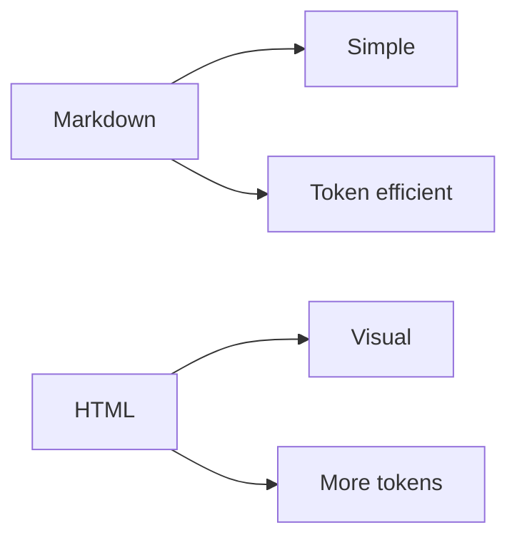

# HTML vs Markdown

> ## Main idea
> HTML uses more tokens than Markdown, but it can make complex information easier to read.

---

## Comparison

| Markdown          | HTML                            |
| ----------------- | ------------------------------- |
| Simple            | More visual                     |
| Uses fewer tokens | Uses more tokens                |
| Easy to edit      | Better for layouts              |
| Good for notes    | Good for reports and prototypes |

---

Why does HTML use more tokens?

HTML needs extra structure for layout, styling, images, diagrams, and interaction.
That extra structure makes the file longer than plain Markdown.

---

