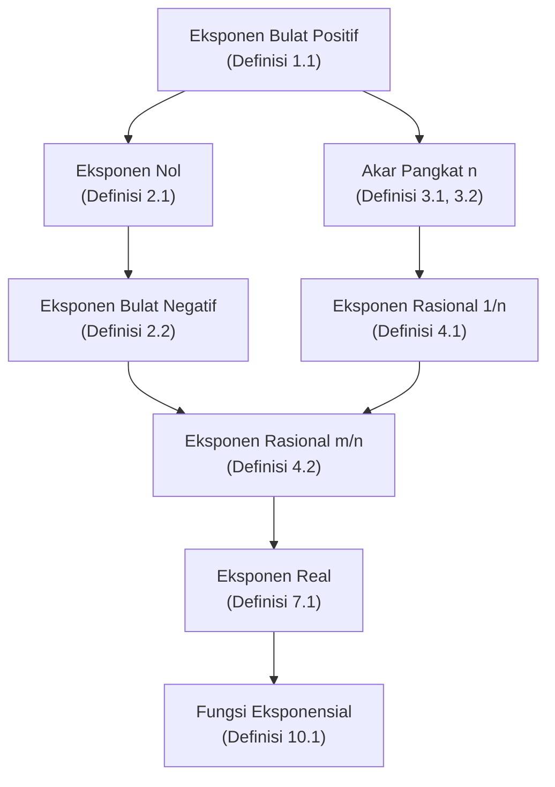

---

tags:

- matematika
- aljabar
- bilangan-berpangkat
- eksponen
- bentuk-akar created: 2026-04-28

---

# Bilangan Berpangkat

## 1. Definisi Dasar

### 1.1. Pangkat Bilangan Bulat Positif

> [!definition] Definisi 1.1 — Pangkat Bilangan Bulat Positif Misalkan $a$ bilangan real dan $n$ bilangan bulat positif. **Bilangan berpangkat** $a^n$ didefinisikan sebagai hasil perkalian berulang $a$ sebanyak $n$ faktor: $$a^n = \underbrace{a \times a \times a \times \cdots \times a}_{n \text{ faktor}}$$

### 1.2. Terminologi

Pada penulisan $a^n$:

- $a$ disebut **basis** (atau bilangan pokok).
- $n$ disebut **eksponen** (atau pangkat).
- $a^n$ disebut **bilangan berpangkat** atau **bentuk eksponensial**.
- Nilai dari $a^n$ disebut **hasil pemangkatan**.

### 1.3. Konvensi Notasi

- $a^1 = a$ (langsung dari Definisi 1.1 dengan $n=1$).
- $a^2$ dibaca _"$a$ kuadrat"_ atau _"$a$ pangkat dua"_.
- $a^3$ dibaca _"$a$ pangkat tiga"_ atau _"$a$ kubik"_.
- Untuk $n \geq 4$, $a^n$ dibaca _"$a$ pangkat $n$"_.

> [!note] Lingkup Definisi 1.1 Definisi 1.1 hanya berlaku untuk eksponen bilangan bulat positif. Perluasan ke eksponen nol, negatif, rasional, dan real disusun pada bagian-bagian berikut. Setiap perluasan dirancang agar sifat-sifat aljabar (Bagian 5) tetap konsisten — prinsip ini disebut **konservasi sifat**.

---

## 2. Perluasan Eksponen ke Bilangan Bulat

### 2.1. Eksponen Nol

> [!definition] Definisi 2.1 — Pangkat Nol Untuk setiap bilangan real $a \neq 0$: $$a^0 = 1$$

> [!check] Justifikasi Definisi ini ditetapkan agar Sifat Hasil Bagi (Sifat 5.2) tetap berlaku saat eksponen pembilang dan penyebut sama. Untuk $a \neq 0$ dan $n$ bilangan bulat positif, dari Definisi 1.1 berlaku $\frac{a^n}{a^n} = 1$. Jika sifat $\frac{a^m}{a^n} = a^{m-n}$ diperluas ke kasus $m = n$, diperoleh $a^{n-n} = a^0$. Karena ruas kiri sama dengan $1$, maka $a^0 = 1$.

> [!warning] Bentuk Tak Terdefinisi $0^0$ Bentuk $0^0$ **tak terdefinisi** dalam aljabar elementer. Alasannya: aturan $a^0 = 1$ mensyaratkan $a \neq 0$, sedangkan aturan $0^x = 0$ mensyaratkan $x > 0$. Kedua aturan tidak dapat keduanya dipenuhi pada $0^0$, sehingga nilainya tidak ditetapkan secara konsisten.

### 2.2. Eksponen Bilangan Bulat Negatif

> [!definition] Definisi 2.2 — Pangkat Bulat Negatif Untuk setiap bilangan real $a \neq 0$ dan bilangan bulat positif $n$: $$a^{-n} = \frac{1}{a^n}$$

> [!check] Justifikasi Definisi ini ditetapkan agar Sifat 5.2 tetap berlaku ketika eksponen pembilang lebih kecil dari eksponen penyebut. Misalkan eksponen pembilang $0$ dan penyebut $n > 0$: $$\frac{a^0}{a^n} = a^{0-n} = a^{-n}$$ Karena $a^0 = 1$, ruas kiri menjadi $\dfrac{1}{a^n}$. Oleh karena itu $a^{-n} = \dfrac{1}{a^n}$.

> [!note] Konsekuensi pada Pecahan Berpangkat Negatif Dari Definisi 2.2 dan Sifat Pangkat dari Hasil Bagi (Sifat 5.5), untuk $a \neq 0$ dan $b \neq 0$: $$\left( \frac{a}{b} \right)^{-n} = \left( \frac{b}{a} \right)^{n}$$ karena $\left( \dfrac{a}{b} \right)^{-n} = \dfrac{1}{\left( \frac{a}{b} \right)^n} = \dfrac{b^n}{a^n} = \left( \dfrac{b}{a} \right)^n$.

---

## 3. Bentuk Akar

### 3.1. Akar Pangkat $n$ (Definisi Umum)

> [!definition] Definisi 3.1 — Akar Pangkat $n$ Misalkan $a$ bilangan real dan $n$ bilangan bulat dengan $n \geq 2$. Bilangan $b$ disebut **akar pangkat $n$ dari $a$** apabila: $$b^n = a$$

### 3.2. Ambiguitas Akar dan Kebutuhan Akar Utama

Definisi 3.1 dapat memberikan **lebih dari satu** akar untuk satu bilangan $a$:

- Untuk $n$ genap dan $a > 0$: terdapat dua akar real (satu positif dan satu negatif), karena bilangan positif maupun negatif dapat menghasilkan bilangan positif jika dipangkatkan dengan bilangan genap.
- Untuk $n$ genap dan $a < 0$: tidak ada akar real, karena pangkat genap dari bilangan real selalu non-negatif.
- Untuk $n$ ganjil: tepat satu akar real, karena fungsi pangkat ganjil bersifat satu-satu pada bilangan real.

Untuk menghindari ambiguitas, didefinisikan **akar utama** (_principal root_).

### 3.3. Akar Utama (Principal Root)

> [!definition] Definisi 3.2 — Akar Pangkat $n$ Utama **Akar pangkat $n$ utama** dari $a$, dilambangkan $\sqrt[n]{a}$, didefinisikan sebagai berikut:
> 
> 1. Jika $n$ **genap** dan $a \geq 0$: $\sqrt[n]{a}$ adalah satu-satunya bilangan real **non-negatif** $b$ yang memenuhi $b^n = a$.
> 2. Jika $n$ **ganjil** dan $a$ bilangan real apa pun: $\sqrt[n]{a}$ adalah satu-satunya bilangan real $b$ yang memenuhi $b^n = a$.
> 3. Jika $n$ **genap** dan $a < 0$: $\sqrt[n]{a}$ **tidak terdefinisi** dalam himpunan bilangan real.

### 3.4. Terminologi Bentuk Akar

Pada $\sqrt[n]{a}$:

- $\sqrt{\phantom{a}}$ disebut **tanda akar** atau **radikal**.
- $a$ disebut **radikan** (bilangan di bawah tanda akar).
- $n$ disebut **indeks akar**.
- Untuk $n=2$, indeks lazim tidak ditulis: $\sqrt{a} \equiv \sqrt[2]{a}$.

### 3.5. Hubungan $\sqrt[n]{a^n}$ dengan $|a|$

> [!theorem] Sifat 3.1 Untuk bilangan real $a$:
> 
> 1. Jika $n$ **ganjil**: $\sqrt[n]{a^n} = a$.
> 2. Jika $n$ **genap**: $\sqrt[n]{a^n} = |a|$.

> [!check] Justifikasi Pada kasus $n$ ganjil, fungsi $b \mapsto b^n$ bersifat satu-satu pada bilangan real, sehingga persamaan $b^n = a^n$ menghasilkan $b = a$, baik $a$ positif maupun negatif. Pada kasus $n$ genap, persamaan $b^n = a^n$ memiliki dua solusi: $b = a$ dan $b = -a$. Karena Definisi 3.2 mensyaratkan akar utama bersifat non-negatif, dipilih $b = |a|$.

---

## 4. Eksponen Rasional

### 4.1. Eksponen Berbentuk $\frac{1}{n}$

> [!definition] Definisi 4.1 — Pangkat $\frac{1}{n}$ Misalkan $a$ bilangan real dan $n$ bilangan bulat dengan $n \geq 2$, sedemikian sehingga $\sqrt[n]{a}$ terdefinisi (sesuai Definisi 3.2). Maka: $$a^{1/n} = \sqrt[n]{a}$$

> [!check] Justifikasi Definisi ini ditetapkan agar Sifat Pangkat dari Pangkat (Sifat 5.3) tetap berlaku. Andaikan $a^{1/n}$ memenuhi sifat tersebut: $$\left(a^{1/n}\right)^n = a^{(1/n) \cdot n} = a^{1} = a$$ Maka $a^{1/n}$ adalah bilangan yang dipangkatkan $n$ menghasilkan $a$, yang menurut Definisi 3.2 sama dengan $\sqrt[n]{a}$.

### 4.2. Eksponen Rasional Umum

> [!definition] Definisi 4.2 — Pangkat Rasional $\frac{m}{n}$ Misalkan $a$ bilangan real positif, dan $\dfrac{m}{n}$ bilangan rasional dengan $m \in \mathbb{Z}$ dan $n \in \mathbb{Z}^+$. Maka: $$a^{m/n} = \sqrt[n]{a^m} = \left(\sqrt[n]{a}\right)^m$$

> [!check] Justifikasi Kesetaraan Dua Bentuk Kesetaraan kedua bentuk berasal dari Sifat 5.3:
> 
> - $\sqrt[n]{a^m} = (a^m)^{1/n} = a^{m \cdot (1/n)} = a^{m/n}$
> - $\left(\sqrt[n]{a}\right)^m = (a^{1/n})^m = a^{(1/n) \cdot m} = a^{m/n}$

> [!warning] Pembatasan Basis pada Eksponen Rasional Definisi 4.2 mensyaratkan $a > 0$. Alasannya: jika $a < 0$, suatu bilangan rasional yang sama dapat dinyatakan dalam bentuk pecahan berbeda yang berakibat hasil yang berbeda atau tak terdefinisi pada bilangan real. Hal ini melanggar **kesatuan nilai** (well-definedness) yang mensyaratkan setiap masukan menghasilkan tepat satu keluaran.
> 
> Pada konteks pendidikan menengah, sebagian sumber mengizinkan $a < 0$ asalkan eksponen rasional dinyatakan dalam **bentuk paling sederhana** dengan penyebut ganjil. Konvensi ini tidak universal dan harus dinyatakan eksplisit dalam konteks penggunaannya.

### 4.3. Konsistensi dengan Definisi-Definisi Sebelumnya

- Untuk $\dfrac{m}{n} = m$ (yaitu $n=1$): $a^{m/1} = \sqrt[1]{a^m} = a^m$, konsisten dengan Definisi 1.1 (jika $m > 0$) atau Definisi 2.2 (jika $m < 0$).
- Untuk $\dfrac{m}{n} = \dfrac{1}{n}$ (yaitu $m=1$): $a^{1/n} = \sqrt[n]{a^1} = \sqrt[n]{a}$, konsisten dengan Definisi 4.1.
- Untuk $\dfrac{m}{n} = 0$ (yaitu $m=0$): $a^{0/n} = \sqrt[n]{a^0} = \sqrt[n]{1} = 1$, konsisten dengan Definisi 2.1.

---

## 5. Sifat-Sifat Bilangan Berpangkat

Pada bagian ini, $a, b$ adalah bilangan real dan $m, n$ adalah eksponen. Pembatasan domain bergantung pada jenis eksponen, dirangkum pada Bagian 5.7.

### 5.1. Sifat Hasil Kali Pangkat (Basis Sama)

> [!theorem] Sifat 5.1 $$a^m \cdot a^n = a^{m+n}$$

> [!check] Justifikasi (untuk $m, n$ bilangan bulat positif) $$a^m \cdot a^n = \underbrace{(a \cdot a \cdots a)}_{m \text{ faktor}} \cdot \underbrace{(a \cdot a \cdots a)}_{n \text{ faktor}} = \underbrace{a \cdot a \cdots a}_{(m+n) \text{ faktor}} = a^{m+n}$$ Untuk eksponen nol, negatif, rasional, dan real, sifat ini diperluas berdasarkan Definisi 2.1, 2.2, 4.2, dan Bagian 7 — perluasan yang konsisten karena definisi-definisi tersebut memang dirancang agar sifat ini tetap berlaku.

### 5.2. Sifat Hasil Bagi Pangkat (Basis Sama)

> [!theorem] Sifat 5.2 Untuk $a \neq 0$: $$\frac{a^m}{a^n} = a^{m-n}$$

> [!check] Justifikasi $$\frac{a^m}{a^n} = a^m \cdot a^{-n} = a^{m + (-n)} = a^{m-n}$$ diturunkan dengan Definisi 2.2 dan Sifat 5.1.

### 5.3. Sifat Pangkat dari Pangkat

> [!theorem] Sifat 5.3 $$\left(a^m\right)^n = a^{m \cdot n}$$

> [!check] Justifikasi (untuk $m, n$ bilangan bulat positif) $$\left(a^m\right)^n = \underbrace{a^m \cdot a^m \cdots a^m}_{n \text{ faktor}} = a^{\overbrace{m+m+\cdots+m}^{n \text{ suku}}} = a^{m \cdot n}$$ diturunkan dengan menerapkan Sifat 5.1 secara berulang.

### 5.4. Sifat Pangkat dari Hasil Kali

> [!theorem] Sifat 5.4 $$(a \cdot b)^n = a^n \cdot b^n$$

> [!check] Justifikasi (untuk $n$ bilangan bulat positif) $$(a \cdot b)^n = \underbrace{(ab)(ab) \cdots (ab)}_{n \text{ faktor}}$$ Karena perkalian bilangan real bersifat **komutatif** dan **asosiatif**, faktor-faktor dapat dikelompokkan ulang: $$= \underbrace{(a \cdot a \cdots a)}_{n \text{ faktor}} \cdot \underbrace{(b \cdot b \cdots b)}_{n \text{ faktor}} = a^n \cdot b^n$$

### 5.5. Sifat Pangkat dari Hasil Bagi

> [!theorem] Sifat 5.5 Untuk $b \neq 0$: $$\left(\frac{a}{b}\right)^n = \frac{a^n}{b^n}$$

> [!check] Justifikasi $$\left(\frac{a}{b}\right)^n = \left(a \cdot b^{-1}\right)^n = a^n \cdot \left(b^{-1}\right)^n = a^n \cdot b^{-n} = \frac{a^n}{b^n}$$ diturunkan dengan Definisi 2.2, Sifat 5.4, dan Sifat 5.3.

### 5.6. Sifat Pangkat Nol dan Pangkat Negatif

Sudah dirumuskan pada Definisi 2.1 dan 2.2:

- $a^0 = 1$ untuk $a \neq 0$.
- $a^{-n} = \dfrac{1}{a^n}$ untuk $a \neq 0$.

### 5.7. Catatan Domain Sifat-Sifat

- Sifat 5.1–5.5 untuk **eksponen bilangan bulat** berlaku pada semua $a, b$, kecuali pada bentuk yang menghasilkan pembagian dengan nol (yaitu basis nol dengan eksponen non-positif).
- Sifat 5.1–5.5 untuk **eksponen rasional atau real** umumnya disyaratkan $a, b > 0$, untuk menjamin bahwa kedua ruas terdefinisi dan menghindari kontradiksi yang dijelaskan pada peringatan Definisi 4.2.

### 5.8. Sifat Turunan

Dari sifat-sifat utama dapat diturunkan beberapa identitas berguna:

> [!theorem] Sifat 5.8.a — Pangkat Negatif Pecahan $$\left(\frac{a}{b}\right)^{-n} = \left(\frac{b}{a}\right)^n \quad (a, b \neq 0)$$

> [!theorem] Sifat 5.8.b — Pangkat dari Hasil Kali Beberapa Faktor $$(a_1 \cdot a_2 \cdots a_k)^n = a_1^n \cdot a_2^n \cdots a_k^n$$ diperoleh dari penerapan Sifat 5.4 secara induksi.

---

## 6. Sifat-Sifat Bentuk Akar

Bentuk akar dapat dipandang sebagai eksponen rasional dengan eksponen $\frac{1}{n}$. Sifat-sifat di bawah ini adalah terjemahan langsung dari sifat eksponen melalui hubungan $\sqrt[n]{a} = a^{1/n}$.

### 6.1. Akar dari Hasil Kali

> [!theorem] Sifat 6.1 Untuk $n \geq 2$ dan domain yang sesuai (yaitu $a, b \geq 0$ jika $n$ genap, atau $a, b \in \mathbb{R}$ jika $n$ ganjil): $$\sqrt[n]{a \cdot b} = \sqrt[n]{a} \cdot \sqrt[n]{b}$$

> [!check] Justifikasi $$\sqrt[n]{ab} = (ab)^{1/n} = a^{1/n} \cdot b^{1/n} = \sqrt[n]{a} \cdot \sqrt[n]{b}$$ diturunkan dari Sifat 5.4 dan Definisi 4.1.

### 6.2. Akar dari Hasil Bagi

> [!theorem] Sifat 6.2 Untuk $n \geq 2$ dan domain yang sesuai (yaitu $a \geq 0, b > 0$ jika $n$ genap, atau $a \in \mathbb{R}, b \neq 0$ jika $n$ ganjil): $$\sqrt[n]{\frac{a}{b}} = \frac{\sqrt[n]{a}}{\sqrt[n]{b}}$$

> [!check] Justifikasi Mengikuti Sifat 5.5 dengan eksponen $\frac{1}{n}$.

### 6.3. Akar Berlapis (Akar dari Akar)

> [!theorem] Sifat 6.3 Untuk domain yang sesuai dan $m, n \geq 2$: $$\sqrt[m]{\sqrt[n]{a}} = \sqrt[m \cdot n]{a}$$

> [!check] Justifikasi $$\sqrt[m]{\sqrt[n]{a}} = \left(a^{1/n}\right)^{1/m} = a^{(1/n)(1/m)} = a^{1/(mn)} = \sqrt[mn]{a}$$ diturunkan dengan Sifat 5.3.

### 6.4. Memasukkan dan Mengeluarkan Faktor dari Tanda Akar

Dengan kombinasi Sifat 6.1 dan Sifat 3.1, suatu faktor di luar tanda akar dapat dimasukkan ke dalam radikan, dan suatu faktor pangkat $n$ di dalam radikan dapat dikeluarkan: $$p \cdot \sqrt[n]{a} = \sqrt[n]{p^n \cdot a}$$ asalkan $p \geq 0$ jika $n$ genap. Sebaliknya, $\sqrt[n]{p^n \cdot a} = |p| \sqrt[n]{a}$ jika $n$ genap, atau $p \sqrt[n]{a}$ jika $n$ ganjil.

### 6.5. Penjumlahan dan Pengurangan Bentuk Akar

> [!definition] Definisi 6.1 — Akar Sejenis Dua bentuk akar disebut **sejenis** jika memiliki **indeks** dan **radikan** yang sama setelah penyederhanaan. Misalnya, $p\sqrt[n]{a}$ dan $q\sqrt[n]{a}$ adalah akar sejenis.

> [!theorem] Sifat 6.4 — Operasi pada Akar Sejenis $$p\sqrt[n]{a} \pm q\sqrt[n]{a} = (p \pm q)\sqrt[n]{a}$$

> [!check] Justifikasi Sifat ini merupakan penerapan **sifat distributif perkalian terhadap penjumlahan/pengurangan** pada bilangan real, dengan $\sqrt[n]{a}$ sebagai faktor bersama.

> [!note] Bentuk Akar Tidak Sejenis Bentuk akar yang tidak sejenis tidak dapat dijumlahkan atau dikurangkan secara langsung. Namun, terkadang dua bentuk akar yang tampak tidak sejenis dapat diubah menjadi sejenis dengan penyederhanaan radikan, yaitu dengan memfaktorkan kuadrat sempurna (atau pangkat $n$ sempurna) keluar dari tanda akar memanfaatkan Sifat 6.1.

### 6.6. Perkalian Bentuk Akar

**Untuk indeks sama:** $$\sqrt[n]{a} \cdot \sqrt[n]{b} = \sqrt[n]{a \cdot b}$$ (langsung dari Sifat 6.1).

**Untuk indeks berbeda:** indeks harus disamakan terlebih dahulu menggunakan **kelipatan persekutuan terkecil** (KPK) dari indeks-indeks tersebut. Hal ini memanfaatkan kesetaraan: $$\sqrt[n]{a} = \sqrt[k \cdot n]{a^k}$$ yang berasal dari $a^{1/n} = a^{k/(k \cdot n)}$.

### 6.7. Merasionalkan Penyebut

> [!definition] Definisi 6.2 — Merasionalkan Penyebut **Merasionalkan penyebut** adalah proses mengubah pecahan yang penyebutnya memuat bentuk akar menjadi pecahan setara yang penyebutnya tidak memuat bentuk akar.

Tujuan merasionalkan penyebut: menyajikan hasil dalam **bentuk standar** dan memudahkan pembandingan atau perhitungan numerik (membagi dengan bilangan rasional lebih sederhana daripada membagi dengan bilangan irasional).

Tiga kasus baku:

#### Kasus 1: Penyebut $\sqrt{a}$

Pecahan dikalikan dengan $\dfrac{\sqrt{a}}{\sqrt{a}}$ (yang nilainya $1$). **Justifikasi:** $\sqrt{a} \cdot \sqrt{a} = a$, yang rasional jika $a$ rasional.

#### Kasus 2: Penyebut $\sqrt[n]{a^k}$ dengan $k < n$

Pecahan dikalikan dengan $\dfrac{\sqrt[n]{a^{n-k}}}{\sqrt[n]{a^{n-k}}}$. **Justifikasi:** $\sqrt[n]{a^k} \cdot \sqrt[n]{a^{n-k}} = \sqrt[n]{a^{k + (n-k)}} = \sqrt[n]{a^n} = a$ (untuk $a \geq 0$ jika $n$ genap).

#### Kasus 3: Penyebut Berbentuk $p + q\sqrt{a}$ atau $\sqrt{a} + \sqrt{b}$

> [!definition] Definisi 6.3 — Konjugat Bentuk Akar **Konjugat** dari bentuk $p + q\sqrt{a}$ adalah $p - q\sqrt{a}$. **Konjugat** dari bentuk $\sqrt{a} + \sqrt{b}$ adalah $\sqrt{a} - \sqrt{b}$.

Pecahan dikalikan dengan konjugat penyebut, dibagi dirinya sendiri. **Justifikasi:** Memanfaatkan identitas selisih kuadrat $(x+y)(x-y) = x^2 - y^2$. Jika $x$ atau $y$ memuat akar, kuadratnya tidak lagi memuat akar (karena $\left(\sqrt{a}\right)^2 = a$). Dengan demikian, penyebut hasil perkalian tidak lagi memuat tanda akar.

---

## 7. Eksponen Bilangan Real

### 7.1. Definisi Melalui Pendekatan Limit

> [!definition] Definisi 7.1 — Pangkat Bilangan Real Untuk $a > 0$ dan $x$ bilangan real (termasuk irasional), $a^x$ didefinisikan sebagai limit: $$a^x = \lim_{k \to \infty} a^{r_k}$$ dengan ${r_k}$ adalah barisan bilangan rasional yang konvergen ke $x$.

### 7.2. Keterdefinisian dan Ketunggalan Nilai

Limit pada Definisi 7.1 ada dan **tidak bergantung** pada pemilihan barisan ${r_k}$ yang konvergen ke $x$. Klaim ini bersandar pada:

1. **Kontinuitas fungsi $r \mapsto a^r$ pada bilangan rasional** (untuk $a > 0$): perubahan kecil pada $r$ menghasilkan perubahan kecil pada $a^r$.
2. **Sifat kelengkapan bilangan real**: setiap barisan Cauchy bilangan real memiliki limit dalam bilangan real.

Pembuktian formal memerlukan analisis real dan berada di luar lingkup catatan ini.

### 7.3. Pembatasan Basis Positif

Pada eksponen real, basis disyaratkan $a > 0$ dengan alasan berikut.

**Untuk $a < 0$ dan $x$ irasional:** tidak ada cara konsisten mendefinisikan $a^x$ dalam bilangan real. Pendekatan dengan barisan rasional menghasilkan nilai yang berosilasi atau tidak konvergen, dan banyak nilai $x$ rasional dengan penyebut genap menghasilkan bilangan kompleks (bukan real).

**Untuk $a = 0$:**

- $0^x = 0$ jika $x > 0$.
- $0^0$ tak terdefinisi (lihat peringatan pada Definisi 2.1).
- $0^x$ tak terdefinisi untuk $x < 0$, karena melibatkan pembagian dengan nol.

### 7.4. Pelestarian Sifat pada Eksponen Real

Semua sifat pada Bagian 5 (Sifat 5.1–5.5) berlaku untuk eksponen real dengan basis positif. Hal ini merupakan konsekuensi dari:

1. Berlakunya sifat-sifat tersebut pada eksponen rasional.
2. Kontinuitas fungsi $r \mapsto a^r$.

Kombinasi keduanya menjamin bahwa sifat aljabar yang berlaku pada subset rasional terbawa ke himpunan real melalui proses limit.

---

## 8. Notasi Ilmiah (Bentuk Baku)

### 8.1. Definisi

> [!definition] Definisi 8.1 — Notasi Ilmiah **Notasi ilmiah** (atau **bentuk baku**) suatu bilangan real $x \neq 0$ adalah penulisan: $$x = a \times 10^n$$ dengan:
> 
> - $a$ bilangan real yang memenuhi $1 \leq |a| < 10$, disebut **mantissa** atau **koefisien**.
> - $n$ bilangan bulat, disebut **eksponen** atau **orde besaran** (_order of magnitude_).

### 8.2. Karakteristik Notasi Ilmiah

- **Ketunggalan (uniqueness):** Notasi ilmiah dari setiap bilangan real bukan nol bersifat **tunggal**, karena syarat $1 \leq |a| < 10$ menjamin tepat satu pasangan $(a, n)$. Tanpa pembatasan ini, satu bilangan dapat ditulis dalam tak hingga banyak bentuk $a \times 10^n$.
- **Tanda:** Tanda $x$ (positif atau negatif) mengikuti tanda $a$. Eksponen $n$ tidak menentukan tanda $x$.
- **Bilangan nol:** Bilangan $0$ tidak memiliki notasi ilmiah baku, karena tidak dapat ditulis sebagai $a \times 10^n$ dengan $|a| \geq 1$.

### 8.3. Hubungan Eksponen $n$ dengan Besaran $|x|$

| Nilai $n$ | Implikasi pada $|x|$ | | ---------- | ---------------------------- | | $n > 0$ | $|x| \geq 10$ | | $n = 0$ | $1 \leq |x| < 10$ | | $n < 0$ | $0 < |x| < 1$ |

**Justifikasi:** karena $1 \leq |a| < 10$, maka $|x| = |a| \cdot 10^n$ memiliki orde besaran yang ditentukan oleh $10^n$.

---

## 9. Persamaan Eksponensial (Konsep Dasar)

### 9.1. Definisi

> [!definition] Definisi 9.1 — Persamaan Eksponensial **Persamaan eksponensial** adalah persamaan yang memuat **variabel pada eksponen** suatu bilangan berpangkat.

### 9.2. Sifat Ketunggalan Eksponen

> [!theorem] Sifat 9.1 — Ketunggalan Eksponen Misalkan $a > 0$ dan $a \neq 1$. Maka: $$a^p = a^q \iff p = q$$

> [!check] Justifikasi Fungsi $f(x) = a^x$ untuk $a > 0$, $a \neq 1$ bersifat **injektif** (satu-satu) pada $\mathbb{R}$:
> 
> - Untuk $a > 1$: $f$ monoton naik tegas (semakin besar $x$, semakin besar $f(x)$).
> - Untuk $0 < a < 1$: $f$ monoton turun tegas (semakin besar $x$, semakin kecil $f(x)$). Pada kedua kasus, $f$ injektif, sehingga nilai keluaran yang sama hanya dapat dihasilkan oleh masukan yang sama.

> [!warning] Pembatasan $a \neq 1$ dan $a > 0$ Sifat 9.1 mensyaratkan $a \neq 1$ karena $1^p = 1^q = 1$ untuk **setiap** $p$ dan $q$, sehingga implikasi $p = q$ tidak berlaku saat basis sama dengan $1$. Sifat juga mensyaratkan $a > 0$ untuk menjamin keterdefinisian $a^p$ dan $a^q$ pada eksponen real (lihat Bagian 7.3).

### 9.3. Pertidaksamaan Eksponensial

> [!theorem] Sifat 9.2 — Monotonisitas Pangkat Untuk $a > 0$, $a \neq 1$, dan $p, q \in \mathbb{R}$:
> 
> 1. Jika $a > 1$: $a^p < a^q \iff p < q$ (monoton naik; tanda pertidaksamaan **dipertahankan**).
> 2. Jika $0 < a < 1$: $a^p < a^q \iff p > q$ (monoton turun; tanda pertidaksamaan **dibalik**).

> [!check] Justifikasi Sifat ini mengikuti sifat monotonisitas fungsi eksponensial yang dijelaskan pada Sifat 9.1. Karena fungsi monoton naik mempertahankan urutan, dan fungsi monoton turun membalik urutan, arah pertidaksamaan ditentukan oleh nilai basis $a$ relatif terhadap $1$.

---

## 10. Fungsi Eksponensial (Konsep Dasar)

### 10.1. Definisi

> [!definition] Definisi 10.1 — Fungsi Eksponensial **Fungsi eksponensial** dengan basis $a$ adalah fungsi $f: \mathbb{R} \to \mathbb{R}^+$ yang didefinisikan oleh: $$f(x) = a^x$$ dengan $a > 0$ dan $a \neq 1$.

### 10.2. Domain dan Range

- **Domain:** $\mathbb{R}$ (semua bilangan real). Alasan: $a^x$ terdefinisi untuk setiap $x$ real ketika $a > 0$ (lihat Bagian 7).
- **Range:** $\mathbb{R}^+ = (0, \infty)$. Alasan: $a^x > 0$ untuk semua $x$ real dengan $a > 0$. Tidak ada $x$ yang membuat $a^x = 0$ atau $a^x < 0$.

### 10.3. Pengecualian $a = 1$

Jika $a = 1$, maka $f(x) = 1^x = 1$ untuk semua $x$ — yaitu fungsi konstan, bukan fungsi eksponensial dalam arti yang dibahas. Karena itu $a = 1$ dikecualikan dari Definisi 10.1.

### 10.4. Karakteristik Grafik

- **Titik tetap pada $x=0$:** Grafik selalu melalui titik $(0, 1)$ karena $a^0 = 1$ untuk setiap $a > 0$.
- **Titik tetap pada $x=1$:** Grafik selalu melalui titik $(1, a)$ karena $a^1 = a$.
- **Asimtot horizontal:** Garis $y = 0$ (sumbu-$x$) merupakan **asimtot horizontal**, karena $a^x$ mendekati $0$ tetapi tidak pernah mencapai $0$ pada salah satu ujung domain.

#### Untuk $a > 1$ (basis lebih besar dari satu)

- Grafik **monoton naik**.
- $a^x \to \infty$ ketika $x \to \infty$.
- $a^x \to 0^+$ ketika $x \to -\infty$ (asimtot kiri).

#### Untuk $0 < a < 1$ (basis di antara nol dan satu)

- Grafik **monoton turun**.
- $a^x \to 0^+$ ketika $x \to \infty$ (asimtot kanan).
- $a^x \to \infty$ ketika $x \to -\infty$.

### 10.5. Bilangan $e$ dan Fungsi Eksponensial Natural

> [!definition] Definisi 10.2 — Bilangan $e$ Bilangan $e$ adalah bilangan irasional yang didefinisikan sebagai: $$e = \lim_{k \to \infty} \left(1 + \frac{1}{k}\right)^k$$ dengan nilai pendekatan $e \approx 2{,}71828,18284,\ldots$

Fungsi eksponensial dengan basis $e$, yaitu $f(x) = e^x$, disebut **fungsi eksponensial natural**. Fungsi ini memiliki kedudukan khusus dalam analisis matematika karena turunannya terhadap $x$ sama dengan dirinya sendiri: $$\frac{d}{dx}(e^x) = e^x$$ (pembuktiannya berada dalam ranah kalkulus diferensial).

---

## 11. Hierarki Pendefinisian

Diagram berikut menggambarkan urutan logis pendefinisian bilangan berpangkat dan menunjukkan bagaimana setiap perluasan domain eksponen diturunkan dari yang sebelumnya.

**Prinsip pemandu:** setiap perluasan domain eksponen ditetapkan sedemikian rupa sehingga sifat-sifat aljabar yang berlaku pada domain sebelumnya (Sifat 5.1–5.5) tetap berlaku pada domain yang baru. Inilah prinsip **konservasi sifat** (_permanence of equivalent forms_).

|Perluasan|Diperoleh dari Sifat|Konsekuensi pada Definisi|
|---|---|---|
|$a^0 = 1$|Sifat 5.2|Definisi 2.1|
|$a^{-n}$|Sifat 5.2|Definisi 2.2|
|$a^{1/n}$|Sifat 5.3|Definisi 4.1|
|$a^{m/n}$|Sifat 5.3|Definisi 4.2|
|$a^x$ untuk $x \in \mathbb{R}$|Kontinuitas + kelengkapan $\mathbb{R}$|Definisi 7.1|